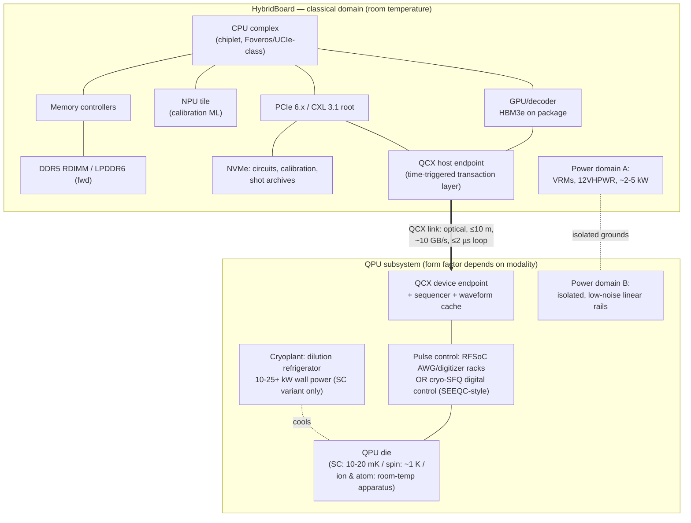

# HybridBoard — A Classical/Quantum Hybrid Motherboard Architecture: Feasibility Study

**Document:** 03-hybrid-board.md
**Series:** Advance Labs Quantum/Classical Hybrid Research
**Date:** June 2026
**Status:** Feasibility study — design concept, not a product specification

---

## 1. Abstract

This study asks a deliberately concrete question: can a quantum processing unit (QPU) be placed on, or tightly coupled to, a classical motherboard alongside a CPU, GPU, and NPU — and if so, for which qubit technologies, at what latency, power, and thermal cost, and with what host software model? We define a hypothetical platform, **HybridBoard**, consisting of a modern chiplet-based classical compute complex, a theoretical **QCX (Quantum Compute Express)** interconnect, and a QPU subsystem whose physical form ranges from an on-package silicon spin-qubit die to a room-sized dilution-refrigerator appliance, depending on the qubit modality.

Our principal findings: (1) the binding constraint is not bandwidth but **latency** — the classical control loop must close well inside qubit coherence times (T1 ≈ 160–350 µs for current superconducting transmons **[Demonstrated]**), which today's best hybrid integrations achieve at ~3–4 µs round trip **[Demonstrated]**; (2) for superconducting QPUs, a "motherboard" is a category error — the system is a rack-and-cryostat installation drawing tens of kilowatts **[Demonstrated]**; (3) silicon spin qubits operating at ≥1 K **[Demonstrated]** and room-temperature neutral-atom/photonic modalities are the only plausible paths to a board- or rack-level form factor within a decade **[Speculative]**; and (4) no consumer or prosumer market for such a board exists in June 2026, and the algorithmic case for local quantum acceleration remains **[Theoretical]** at best for nearly all workloads. We give a full block diagram, component spec table, and NASA TRL assessment per subsystem.

---

## 2. Classical Compute Side: Die Integration and Interconnects

### 2.1 State of heterogeneous die integration (June 2026)

Modern classical platforms already solve a problem structurally similar to classical/quantum integration: combining dies with incompatible process technologies, power envelopes, and signaling requirements into one coherent compute complex.

- **Intel Meteor Lake (Core Ultra)** disaggregates the SoC into four active tiles — Compute (Intel 4), Graphics (TSMC N5), SoC/NPU (TSMC N6), and I/O (TSMC N6) — stacked on a passive Foveros 3D base tile with through-silicon-via (TSV) connections, behaving "as close to one monolithic die as possible" **[Demonstrated]** [14]. This is the existence proof that four dies from three different process nodes can share one package with near-monolithic latency.
- **AMD Instinct MI300X** integrates eight accelerator compute dies (XCDs, 304 CUs total) with 192 GB of HBM3 at 5.3 TB/s peak bandwidth via 2.5D/3D die stacking; chiplets communicate over Infinity Fabric, with 128 GB/s links between GPUs (896 GB/s aggregate per GPU in an 8-GPU board) **[Demonstrated]** [15].
- **Apple M-series (UMA)** demonstrates the unified-memory end state: a single physical address space shared by CPU, GPU, and Neural Engine. The 2025 M5 delivers 153.6 GB/s (LPDDR5X-9600, base die), 307 GB/s (M5 Pro), and up to 614 GB/s (M5 Max); the M3 Ultra reaches 819 GB/s **[Demonstrated]** [16][17]. UMA is the architectural template for HybridBoard's *classical* shared-address-space design (Section 5) — though, critically, quantum registers cannot participate in it.

### 2.2 Chip-to-chip and board-level interconnects

| Interconnect | Generation (June 2026) | Raw signaling | Realized bandwidth | Latency class | Status |
|---|---|---|---|---|---|
| PCIe 5.0 x16 | shipping volume | 32 GT/s | ~64 GB/s/dir (~128 GB/s bidir) | ~100s of ns end-to-end | **[Demonstrated]** |
| PCIe 6.x x16 | early platforms | 64 GT/s, PAM4 + FEC | ~128 GB/s/dir | similar; FEC adds ~ns-class | **[Demonstrated]** [18] |
| CXL 3.1 (on PCIe 6.1 PHY) | spec final; silicon ramping | 64 GT/s | up to 128 GB/s bidir per x16 | 256B latency-optimized flit = zero-latency adder vs CXL 2.0; retimers <12 ns pin-to-pin | **[Demonstrated]** (spec + retimer silicon) [18][19] |
| NVLink 5 (Blackwell) | shipping | 18 links/GPU | 1.8 TB/s per GPU | sub-µs GPU-GPU | **[Demonstrated]** [20] |
| NVLink 6 (Rubin) | full production; volume shipping H2 2026 | — | 3.6 TB/s per GPU; 260 TB/s per NVL72 rack | sub-µs | **[Demonstrated]** (production confirmed, volume shipping H2 2026) [20][21] |
| UCIe 2.0 (die-to-die) | spec final, adopters shipping | 32 GT/s/lane | bandwidth density scales with bump pitch; 3D packaging supported | ~ns-class die-to-die | **[Demonstrated]** [22] |
| UCIe 3.0 (die-to-die) | spec released Aug 2025 | 48/64 GT/s/lane | 2× UCIe 2.0; UCIe-3D bump pitch 25 µm down to ≤1 µm | ~ns-class | **[Theoretical]** (spec exists; volume silicon pending) [22][23] |

Two observations drive the QCX design in Section 4. First, classical interconnect bandwidth (10²–10³ GB/s) exceeds any plausible QPU control-data requirement by 2–4 orders of magnitude (Section 4.2). Second, classical interconnect *latency* (ns-class on package, ~100 ns–1 µs across a board/rack) is comfortably inside qubit coherence windows — the latency problem in hybrid systems comes from software stacks and instrument round trips, not from the wires.

---

## 3. Quantum Compute Side: QPU Physical Requirements by Technology

### 3.1 Modality survey

| Modality | Operating temperature | Physical plant | Representative vendors / state (June 2026) | Board-integration outlook |
|---|---|---|---|---|
| Superconducting transmon | 10–20 mK (dilution refrigerator) | Cryostat, mu-metal shielding, microwave lines, ~5–25+ kW wall power | IBM Heron 133/156 q + Nighthawk 120 q (available Jan 2026) **[Demonstrated]** [1][2][3]; Google Willow 105 q, below-threshold QEC **[Demonstrated]** [4][5] | Worst — system is a room, not a board |
| Trapped ion | Ions at mK motional temps via laser cooling; **apparatus at room temperature** (UHV chamber + lasers/electronics) | Vacuum system, lasers or integrated electronic control, racks | IonQ Forte / Forte Enterprise (36 AQ, rack-mounted, "typical modern data center" install) **[Demonstrated]** [6][7]; IonQ Tempo at #AQ 64 (Sept 2025) **[Demonstrated]** [8]; Quantinuum Helios: 98 Ba⁺ qubits, 99.921% 2Q fidelity, 48 error-corrected logical qubits, launched Nov 2025 **[Demonstrated]** [9][10] | Rack-level today; board-level **[Speculative]** |
| Photonic | Photonics at room temperature; superconducting single-photon detectors require ~K-class cryocoolers | Foundry-fabbed photonic chips (GlobalFoundries Fab 8 for PsiQuantum) + cryo detector modules | PsiQuantum: $1B Series E; utility-scale Brisbane/Chicago sites; public reporting puts timelines closer to ~2030 **[Demonstrated]** (chips) / **[Speculative]** (utility scale) [11] | Chip is board-friendly; detector cryogenics are not (yet) |
| Neutral atom | Room-temperature apparatus (atoms laser-cooled in UHV cell) | Vacuum cell, laser/optics racks; Pasqal Orion ships rack-mountable at ~3 kW **[Demonstrated]** [12] | QuEra/Harvard: 48 logical qubits on 280 physical atoms (Nature 2024) **[Demonstrated]** [13]; Pasqal ~1,000 atoms (2024), 10,000-atom roadmap **[Demonstrated]** / roadmap **[Speculative]** [12] | Best near-term *rack* story; optics miniaturization is the blocker for a *board* |
| Silicon spin qubits | ~0.1–1+ K — **operable above 1 kelvin** with fault-tolerance-range fidelities **[Demonstrated]** [24] | Compact cryostat (1 K stages have ~100–1000× the cooling power of 20 mK stages); CMOS-compatible fabrication | Intel Tunnel Falls: 12-qubit arrays on 300 mm line, 95% yield, EUV **[Demonstrated]** [25][26]; Diraq/UNSW: 99.85% 1Q / 98.92% 2Q above 1 K (Nature 2024) **[Demonstrated]** [24]; imec+Diraq: industry-compatible unit cells >99% (Nature 2025) **[Demonstrated]** [27] | **Most integration-friendly** — a CMOS-foundry die at 1 K is the only credible "QPU chiplet" |
| Cryo classical control (enabler) | mK, co-located with qubits | Single-flux-quantum (SFQ) digital logic | SEEQC: first full-stack system with SFQ digital qubit control at millikelvin, >99.5% gate fidelity, Nature Electronics (Mar 2026) **[Demonstrated]** [28][29]; ITRI manufacturing line (Dec 2025) **[Demonstrated]** [30] | Removes the room-temperature control bottleneck for SC qubits |

### 3.2 Which technologies are closest to on-board integration?

Ranked by plausibility of a literal board/package-level QPU within ~10 years:

1. **Silicon spin qubits** — the qubit die is a CMOS-foundry product (~50 nm × 50 nm qubits, 300 mm wafers **[Demonstrated]** [25]); ≥1 K operation **[Demonstrated]** [24] moves the cryogenic requirement from a dilution refrigerator to a far smaller closed-cycle cryocooler. A socketed "cryo-module" on a board edge is **[Speculative]** but not physically absurd.
2. **Photonic** — the compute chip itself is board-compatible silicon photonics **[Demonstrated]** [11]; the unsolved board-level problem is the cryogenic single-photon detector subsystem and the sheer component count implied by fault-tolerant photonic architectures (~10⁶ physical qubits) **[Speculative]**.
3. **Neutral atom** — room temperature and ~3 kW rack form factors exist today **[Demonstrated]** [12], but lasers, modulators, and a UHV cell resist board-ification. Rack-as-peripheral is the realistic form.
4. **Trapped ion** — same conclusion as neutral atom; IonQ's electronic (laser-free) qubit control on semiconductor chips, slated for 256-qubit systems demonstrated in 2026, would improve this **[Demonstrated]** (prototype results) / **[Speculative]** (board form factor) [8].
5. **Superconducting** — never a board; the QPU die is tiny, but it is inseparable from a multi-tonne cryogenic plant. SEEQC's mK SFQ control [28] shrinks the wiring problem, not the refrigerator.

---

## 4. QCX Bus: A Theoretical "Quantum Compute Express" Interconnect

QCX is our proposed point-to-point interconnect between the HybridBoard classical complex and the QPU control subsystem. Everything in this section is **[Theoretical]** design work unless tagged otherwise; it is constrained by, and benchmarked against, demonstrated systems.

### 4.1 The hard constraint: latency budget vs coherence time

The control loop that matters is: *measure qubits → move syndrome/result data to classical logic → decode/decide → apply conditioned pulses*. This loop must complete well within the coherence window:

- Superconducting T1 (median): ~160–170 µs (IBM Heron) to ~350 µs (IBM Nighthawk, record) **[Demonstrated]** [3][31].
- Google's below-threshold surface-code experiment ran error-correction cycles at ~1 µs-class cadence with real-time decoding **[Demonstrated]** [5].
- Demonstrated GPU↔QPU round trip: NVIDIA DGX Quantum (Grace Hopper + Quantum Machines OPX) achieves <4 µs, with 3.3 µs measured — roughly 1,000× faster than cloud-API-mediated loops **[Demonstrated]** [32][33].
- Sub-microsecond decode-feedback QEC loops have been reported in open-source FPGA control stacks **[Demonstrated]** [34].

**QCX latency budget (target, per round trip):**

| Segment | Budget | Rationale |
|---|---|---|
| Readout digitization + DSP | 300–500 ns | demonstrated integration windows on RFSoC-class hardware [35] |
| QCX transport (QPU-side ctrl → host) | ≤100 ns | feasible: CXL retimer pin-to-pin <12 ns **[Demonstrated]** [19]; PCIe-class PHY traversal is ~100 ns-class |
| Host decode/branch (GPU/NPU kernel) | ≤1 µs | demonstrated within DGX Quantum envelope [32] |
| QCX transport (return) + pulse trigger | ≤200 ns | symmetric path + sequencer dispatch |
| **Total** | **≤2 µs** | ~1% of a 200 µs T1; ~2 QEC cycles of slack |

A 2 µs loop against T1 ≈ 200 µs gives a duty-cost of ~10⁻² of the coherence budget per branch — acceptable. Against trapped-ion coherence (seconds-class **[Demonstrated]** [9]), the constraint is trivial; the binding case is superconducting QEC, where the decoder must keep pace with a ~1 µs syndrome cycle indefinitely or the backlog grows as Θ(t) **[Proven]** (queueing argument: arrival rate exceeding service rate yields unbounded queue).

### 4.2 Bandwidth: pulse-level control data rates

Per superconducting qubit, direct-digital pulse synthesis uses DAC channels at ~1 GS/s effective per channel inside the FPGA fabric (RFSoC converters run 4–6.5 GS/s with interpolation) **[Demonstrated]** [35][36][37].

- Raw streaming worst case: 1 GS/s × 16 bit × 2 (I/Q) ≈ 4 GB/s per drive channel → 50 qubits ≈ 0.2 TB/s; 5,000 qubits ≈ 20 TB/s. Streaming raw waveforms across the board is therefore a non-starter at scale.
- QCX instead mandates **waveform caching at the QPU-side sequencer** (the approach of QICK [35], QubiC 2.0 [36], and commercial controllers): the host sends parameterized gate opcodes (~10 bytes per gate), and the sequencer expands them locally. Effective host→QPU bandwidth need: ~10⁴ gates × 10 B per shot at 10³–10⁵ shots/s ≈ 1–10 GB/s — within a PCIe 5.0 x4 envelope.
- Readout return path: O(1) byte per qubit per measurement (discriminated), or ~kB per qubit (raw IQ traces, calibration mode). Syndrome streams for 5,000 physical qubits at 1 MHz cycle rate ≈ 5 GB/s — again x4-link-class.

**Conclusion:** QCX needs ~10 GB/s sustained, ~100 ns transport latency, and — the differentiator from PCIe/CXL — **deterministic, time-triggered delivery**. **[Theoretical]**

### 4.3 QCX packet/serialization format (proposal)

QCX adopts CXL 3.1's 256 B latency-optimized flit **[Demonstrated]** [18] as its PHY/link layer and defines a quantum transaction layer:

```
QCX Flit (256 B, time-triggered)
┌────────────┬──────────────────────────────┬─────────────┐
│ Header 16B │ Payload 224B                  │ CRC/FEC 16B │
├────────────┼──────────────────────────────┼─────────────┤
│ type: GATE | PULSE | MEAS | SYNC | CAL | RESULT          │
│ vqid[16]   : virtual qubit ID (host-side mapping)        │
│ t_exec[64] : execution timestamp (ps resolution,         │
│              global QCX epoch — time-triggered, not      │
│              best-effort)                                │
│ seq[32]    : shot / circuit sequence number              │
│ GATE payload : opcode, target vqids, θ/φ params (f32)    │
│ MEAS RESULT  : bitmask + confidence + timestamp          │
│ CAL payload  : raw IQ window (segmented across flits)    │
└──────────────────────────────────────────────────────────┘
```

Key departures from PCIe semantics: (a) **timestamped execution** rather than load/store ordering — gates execute at t_exec, not on arrival; (b) **no retry on the real-time channel** — a late flit is a discarded flit plus an error counter, because re-delivered pulses are physically meaningless after the coherence window; (c) a separate **bulk channel** (ordinary CXL.io semantics) for calibration data and waveform table uploads. **[Theoretical]**

### 4.4 Comparison to existing approaches

| Approach | Where classical control sits | Loop latency | Notes |
|---|---|---|---|
| IBM third-generation control electronics (System Two) | Room temperature, rack-scale, beside cryostat | µs-class internal; cloud users see ms–s | **[Demonstrated]** [1] |
| NVIDIA DGX Quantum / Quantum Machines | Room temperature; Grace Hopper coupled to OPX controller | <4 µs GPU↔QPU round trip (3.3 µs shown) | **[Demonstrated]** [32][33]; deployed at Jülich **[Demonstrated]** [38] |
| SEEQC SFQ digital control | **Inside the cryostat at mK**, co-fabricated control | Pulse-level control without per-qubit coax to room temp; >99.5% fidelities maintained | **[Demonstrated]** [28][29] |
| QCX (this work) | Board-level, time-triggered transaction layer over CXL-class PHY | ≤2 µs target | **[Theoretical]** |

QCX is best understood as standardizing the DGX-Quantum-style coupling into a board-level, vendor-neutral transaction layer — and, for superconducting systems, terminating at an SEEQC-style cryo-digital endpoint rather than at racks of coax.

---

## 5. Memory Architecture

### 5.1 Classical memory selection (verified, June 2026)

- **DDR5** remains the volume standard. **DDR6 is not available in June 2026**: JEDEC's ratification has slipped into 2026 (draft completed late 2024; targets of 8,800–17,600 MT/s), with first hardware expected late 2026 and broad adoption in 2027. The only finalized DDR6-era standard is **LPDDR6 (JESD209-6, published July 2025**, 10,667–14,400 MT/s) **[Demonstrated]** (spec status) [39]. HybridBoard v1 therefore specifies DDR5 RDIMMs plus LPDDR6 as a forward option for the control complex.
- **HBM3/HBM3e** on the GPU/NPU package (MI300X-class: 192 GB HBM3 at 5.3 TB/s **[Demonstrated]** [15]) serves decoder working sets: surface-code decoding state for thousands of qubits, syndrome history ring buffers, and ML-based decoder weights.

### 5.2 Shared address space — what is and is not mappable

HybridBoard exposes a single classical physical address space (UMA-style, per Apple M-series precedent **[Demonstrated]** [16]) containing:

| Region | Backing | Contents |
|---|---|---|
| QCX MMIO window | QPU-side control registers | sequencer config, timing epoch, error counters |
| Syndrome/result ring buffers | host DRAM, DMA-written by QCX endpoint | measurement bitstreams, timestamps |
| Waveform/calibration store | host DRAM/NVMe, bulk channel | pulse tables, per-qubit calibration constants |
| Circuit object store | NVMe | QASM/QIR circuit descriptions, transpiled binaries |

**Quantum registers do not appear in this address space.** This is not an engineering limitation but a physical one:

- **No-cloning theorem**: an unknown quantum state cannot be copied — linearity of quantum mechanics forbids it **[Proven]** (Wootters & Zurek, *Nature* 299, 802 (1982) [40]). There is no quantum analog of a DMA read, checkpoint, or swap-out: any "read" is a measurement.
- **Measurement collapse**: reading n qubits yields n classical bits and destroys the superposition; the 2ⁿ complex amplitudes are not recoverable from any single shot **[Proven]**. (Holevo's bound formalizes that n qubits cannot convey more than n classical bits of accessible information.)
- Consequently a "suspend-to-disk" of quantum state is physically impossible, and quantum memory cannot be virtualized, paged, or mirrored. **[Proven]**

**What CAN be persisted** (and what HybridBoard's firmware treats as the durable representation of "quantum state"):

1. **Circuit descriptions** (OpenQASM/QIR) — the *program*, O(g) bytes for g gates.
2. **Calibration data** — per-qubit frequencies, pulse amplitudes, crosstalk matrices; O(n²) worst case for n qubits.
3. **Measurement results** — shot tables, syndrome streams, expectation-value estimates; O(shots × n) bits.
4. **Random seeds and transpilation artifacts** — sufficient to *re-execute*, which is the only legitimate notion of "restoring" a quantum computation.

---

## 6. Power Architecture

Verified anchor points: lab-scale dilution refrigerators draw ~5–10 kW wall power, large systems up to ~25–26 kW, with pulse-tube coolers dominating at ~10–15 kW (wall-to-cold efficiency ~1:1500) **[Demonstrated]** [41]; a RAND analysis extrapolates ~6 W per physical qubit all-in for a future large superconducting machine, i.e. ~125 MW for a cryptanalytically relevant system **[Theoretical]** [42]; Pasqal's neutral-atom Orion runs at ~3 kW total **[Demonstrated]** [12].

**HybridBoard total power estimates (superconducting QPU variant):**

| Subsystem | 50 physical qubits | 500 physical qubits | 5,000 physical qubits | Tag |
|---|---|---|---|---|
| Dilution refrigerator (pulse tubes, compressors, pumps) | 10–15 kW (1 small cryostat) | 20–30 kW (1 large cryostat) | 50–100 kW (multi-cryostat / System-Two-class plant) | **[Demonstrated]** (50/500 anchors [41]) / **[Speculative]** (5,000) |
| QPU control electronics (room-temp RFSoC/sequencers, ~2–4 ch/qubit) | 2–5 kW | 15–40 kW | 100–250 kW (or far less with cryo-SFQ control [28] **[Speculative]**) | **[Demonstrated]** (per-channel anchors) / **[Theoretical]** (scaling) |
| Classical complex (CPU + 1× GPU + NPU + DRAM + NVMe) | 1.5–2.5 kW | 2.5–5 kW (decoder GPUs added) | 10–30 kW (decoder cluster) | **[Demonstrated]** (component TDPs) |
| Power conversion / distribution losses (~10%) | ~1.5–2 kW | ~4–7 kW | ~15–40 kW | **[Theoretical]** |
| **Total "board" (really: installation) TDP** | **≈ 15–25 kW** | **≈ 40–80 kW** | **≈ 175 kW–0.4 MW** | **[Speculative]** at 5,000 q |
| Cross-check vs ~6 W/qubit all-in [42] | 0.3 kW/qubit ≈ small-system overhead dominates | ~0.1 kW/qubit | converging toward ~0.04–0.08 kW/qubit | **[Theoretical]** |

For contrast, the room-temperature variants change the picture entirely: a neutral-atom QPU subsystem at ~3 kW **[Demonstrated]** [12] plus a 2 kW classical complex yields a ~5–6 kW total — a high-end server rack budget, not a facility budget.

---

## 7. Thermal Design

### 7.1 Superconducting variant: the "board" is a room

A 20 mK cryostat is physically incompatible with co-location on a literal motherboard:

- **Scale**: IBM Quantum System Two measures roughly 22 feet wide by 12 feet high **[Demonstrated]** [1][43]. The QPU die is centimeters; its life-support is architectural.
- **Vibration**: pulse-tube cryocoolers impose ~1–2 Hz mechanical cycling; qubit packages require vibration isolation from exactly the rotating machinery (fans, pumps, compressors) that classical kW-class cooling relies on. Co-locating a 2 kW air- or liquid-cooled classical complex on the cryostat frame would couple vibration and acoustic noise directly into the mixing-chamber stage. Engineering separation of meters, with isolated mounting, is the demonstrated practice **[Demonstrated]** (standard cryostat installation practice per vendor system requirements [41]).
- **EMI**: transmon transition frequencies sit at 4–6 GHz — squarely amid classical clock harmonics, DDR5 signaling, and switching-regulator noise. Superconducting QPUs operate inside mu-metal and superconducting shields; a GPU dissipating ~700 W centimeters away is an EMI design nightmare. Minimum practical posture: classical complex in an adjacent shielded rack, QCX crossing the boundary on optical fiber **[Theoretical]**.
- **Realistic chassis**: HybridBoard-SC is therefore a *row*: cryostat island (3 m × 3 m × 3 m, seismic-isolated slab) + control rack + classical rack, QCX over ≤10 m optical links (~50 ns fiber delay — within budget per Section 4.1). **[Theoretical]**

### 7.2 Room-temperature and 1 K variants: where a board is plausible

- **Neutral atom / trapped ion**: the QPU is already a rack appliance (~3 kW, standard data-center install) **[Demonstrated]** [7][12]. "HybridBoard" here means a backplane-level integration where the classical host and the QPU controller share a chassis — feasible with conventional forced-air/liquid cooling, provided laser and optics modules get vibration-damped mounts **[Theoretical]**.
- **Silicon spin qubits at ~1 K**: 1 K is reachable with compact closed-cycle coolers far smaller than dilution refrigerators, and 1 K stages offer orders of magnitude more cooling power than 20 mK stages **[Demonstrated]** (operating regime) [24]. A sealed cryo-module of small-refrigerator size hosting a spin-qubit die + cryo-CMOS control, mounted on the board edge like a power supply, is the most credible literal interpretation of a "quantum motherboard" — **[Speculative]**, with the qubit-count and fidelity gap (12-qubit arrays today [25]) being the real blocker, not the thermals.

---

## 8. OS / Firmware Interface

All of Section 8 is **[Theoretical]** design (no shipping platform exposes a QPU through UEFI/ACPI today); precedents cited are real.

### 8.1 UEFI extensions

- **QPU DXE driver**: enumerates the QCX endpoint during DXE phase, reads a Quantum Capability Structure (qubit count, topology, modality, calibration-store pointer), and publishes an `EFI_QPU_PROTOCOL` (analogous to existing UEFI device protocols).
- Boot policy: the QPU is *never* on the boot-critical path; cryogenic subsystems report readiness asynchronously (cooldown from room temperature is hours–days for dilution systems **[Demonstrated]** [41]), so firmware models the QPU as a late-attach device with a `QPU_NOT_COLD` status that may persist across many OS boots.

### 8.2 ACPI: the QDEV concept

We propose a `QDEV` ACPI device object (vendor namespace, e.g. `ACPI\QCX0001`) carrying:

| QDEV field | Content |
|---|---|
| `_HID` / `_CID` | QCX endpoint identity |
| `QTOP` | qubit count, coupling-map blob (analog of NUMA SLIT/SRAT for qubit topology) |
| `QCAL` | handle to non-volatile calibration store |
| `QTHM` | cryo-plant state machine (WARM / COOLING / COLD / REGEN) surfaced to OSPM power management |
| `_PSx` analog | QPU "power states" map to *availability* states, since the cryoplant cannot be cycled like a PCIe function |

### 8.3 Linux platform driver model

- A `qcx` bus driver (modeled on the existing PCIe/CXL core) enumerating QPU functions; a character device per QPU (`/dev/qpu0`) exposing: circuit submission queue (io_uring-style rings mapping to Section 5.2's buffers), mmap'd result rings, and a calibration sysfs tree.
- Scheduling: shots are non-preemptible at microsecond granularity; the driver exposes a real-time submission class so QEC decode threads can pin to isolated cores — the same isolation pattern used for DPDK/real-time networking today.
- Userspace: Qiskit/CUDA-Q-class runtimes sit atop the device node; CUDA-Q's tight GPU coupling on DGX Quantum is the demonstrated precedent for the runtime layer **[Demonstrated]** [32].

---

## 9. Market Landscape

### 9.1 What you can actually buy (June 2026)

| Product | Vendor | Form factor | Notable specs | Status |
|---|---|---|---|---|
| Quantum System One / System Two | IBM | Facility installation (System Two: ~22 ft × 12 ft) | Heron 133/156 q; Nighthawk 120 q, square lattice, target 7,500 two-qubit gates in 2026; Starling (200 logical qubits, 10⁸ gates) targeted 2029 | **[Demonstrated]** (shipping) / **[Speculative]** (roadmap) [1][2][3][44] |
| Forte / Forte Enterprise | IonQ | **Rack-mounted, standard data center** | 36 algorithmic qubits; Tempo line hit #AQ 64 (Sept 2025); 256-qubit EQC systems to be demonstrated 2026 | **[Demonstrated]** / roadmap **[Speculative]** [6][7][8] |
| H-Series → Helios | Quantinuum | On-premise or cloud | 98 physical Ba⁺ qubits, 99.921% 2Q fidelity, 48 error-corrected logical qubits, QCCD architecture, Guppy hybrid programming | **[Demonstrated]** [9][10] |
| Orion line | Pasqal | Rack-mountable, room temperature, ~3 kW | ~1,000-atom class systems; 10,000-qubit roadmap | **[Demonstrated]** / **[Speculative]** [12] |

### 9.2 What HybridBoard would add — and an honest assessment

A consumer/prosumer hybrid board would add: local sub-2 µs hybrid loops (vs ms–s cloud round trips), data locality/sovereignty, and a standardized OS attach model. The honest assessment:

- **The latency benefit is real but currently institutional.** The only workloads that need µs-class loops are QEC decoding and variational/calibration inner loops — exactly what DGX Quantum sells to HPC centers **[Demonstrated]** [32][38], a market of dozens of sites, not millions of desks.
- **The algorithmic case for a consumer QPU does not exist.** Proven asymptotic separations are narrow: Shor factors n-bit integers in poly(n) — roughly O(n² log n log log n) quantum gates — vs the best-known classical algorithm, the (itself heuristic) number field sieve at exp(O(n^{1/3}(log n)^{2/3})) **[Proven]** (Shor's runtime; the separation is vs best-known classical, not a proven classical lower bound) [45], and Grover search is Θ(√N) vs classical Θ(N) **[Proven]** [46] — a quadratic speedup that constant-factor overheads erase at consumer scale **[Theoretical]**. Quantum-ML claims built on HHL (solving sparse linear systems in O(log(N)·s²κ²/ε) vs classical conjugate-gradient O(N·s·κ·log(1/ε))) carry the well-documented fine print: efficient preparation of |b⟩, condition number κ growing at most polylogarithmically, sparsity s, and the fact that the output is a quantum state from which only O(n) bits per shot are readable — not the full solution vector **[Theoretical]**, per Harrow–Hassidim–Lloyd [47] and Aaronson's caveat analysis [48].
- **Conclusion:** the prosumer market for HybridBoard does not exist in 2026 and will not until (a) fault-tolerant machines demonstrate commercially relevant advantage, and (b) a modality shrinks to a board-attachable form factor. Both are plausibly >5–10 years out **[Speculative]**. The defensible near-term product is the **HPC-node variant** (Section 7.1's "row") and the **rack-backplane variant** for room-temperature modalities.

---

## 10. Block Diagram



Domain boundaries: everything left of the QCX link is ordinary classical engineering; everything right of it is modality-specific. For the spin-qubit variant, QSUB collapses into a board-edge cryo-module; for the superconducting variant, QSUB is a shielded room.

---

## 11. Component Spec Table

| # | Block | Specified part / basis | Real or theoretical? |
|---|---|---|---|
| 1 | CPU complex | Chiplet CPU with Foveros/UCIe-class packaging (Meteor-Lake-pattern tiles [14]) | **Real** (pattern) — specific SKU open |
| 2 | GPU / QEC decoder | AMD MI300X-class (192 GB HBM3, 5.3 TB/s [15]) or NVIDIA Blackwell/Rubin (NVLink 5/6: 1.8/3.6 TB/s [20][21]) | **Real** |
| 3 | NPU | Integrated NPU tile (Meteor Lake SoC-tile pattern [14]) for calibration/drift ML | **Real** (part) — role theoretical |
| 4 | System memory | DDR5 RDIMM; LPDDR6 (JESD209-6) forward option; **DDR6 excluded — not ratified as of June 2026** [39] | **Real** |
| 5 | Storage | NVMe SSD (circuit/calibration/shot store) | **Real** |
| 6 | Host I/O | PCIe 6.x + CXL 3.1, 64 GT/s, latency-optimized flits [18][19] | **Real** (spec/early silicon) |
| 7 | QCX host + device endpoints | CXL 3.1 PHY + custom time-triggered transaction layer (Section 4.3) | **Theoretical** |
| 8 | QPU pulse control | RFSoC-class AWG/digitizers (4–6.5 GS/s converters; QICK/QubiC lineage [35][36][37]) or Quantum Machines OPX-class (DGX Quantum pairing [32]) | **Real** |
| 9 | Cryo-digital control option | SEEQC SFQ control at mK, >99.5% fidelity, Nature Electronics 2026 [28][29] | **Real** (5-qubit demo) — scale theoretical |
| 10 | QPU (superconducting) | IBM Heron/Nighthawk-class (120–156 q) [2][3] or Google Willow-class (105 q) [4][5] | **Real** — not merchant silicon (cannot be purchased as a component) |
| 11 | QPU (trapped ion) | IonQ Forte Enterprise (36 AQ, rack) [6][7]; Quantinuum Helios (98 q) [9][10] | **Real** (system-level only) |
| 12 | QPU (neutral atom) | Pasqal Orion-class rack, ~3 kW [12]; QuEra logical-qubit architecture [13] | **Real** (system-level only) |
| 13 | QPU (spin, board-attach cryo-module) | Tunnel-Falls-lineage 300 mm die [25][26] + Diraq ≥1 K operation [24][27] in closed-cycle cooler | **Theoretical** (module); dies real at 12-qubit scale |
| 14 | Cryoplant | Bluefors-class dilution refrigerator, ~10–25 kW wall [41] | **Real** |
| 15 | Power subsystem | Dual-domain: switching VRMs (classical) + isolated low-noise rails (quantum control) | **Real** parts / **theoretical** integration |
| 16 | Firmware/OS | UEFI QPU DXE driver, ACPI QDEV object, Linux `qcx` bus driver (Section 8) | **Theoretical** |

---

## 12. TRL Assessment

NASA Technology Readiness Levels, 1 (basic principles) to 9 (flight proven / mission operations); we map TRL 9 to "deployed in routine commercial operation."

| Component | TRL | Justification |
|---|---|---|
| Classical chiplet compute complex (CPU/GPU/NPU, UCIe-class packaging) | 9 | Shipping in volume (Meteor Lake, MI300X, M-series) **[Demonstrated]** [14][15][16] |
| DDR5 / HBM3 memory subsystem | 9 | Volume production **[Demonstrated]** [15] |
| LPDDR6 subsystem | 5–6 | Spec published July 2025; platform validation underway, products late 2026+ **[Demonstrated]** (spec) [39] |
| PCIe 6.x / CXL 3.1 host fabric | 6–7 | Spec final; retimer/controller silicon demonstrated; ecosystem ramping [18][19] |
| Superconducting QPU (100–150 q, utility-class) | 7–8 | Multiple deployed commercial systems (IBM, Google early access) but continuous calibration-intensive operation; not turnkey [1]–[5] |
| Trapped-ion QPU (rack, data-center install) | 7–8 | Forte Enterprise/Helios commercially installed [6][7][9][10] |
| Neutral-atom QPU (rack, room temp) | 6–7 | Commercial racks shipping; logical-qubit results lab-demonstrated [12][13] |
| Photonic fault-tolerant QPU | 3–4 | Foundry chip manufacturing proven; utility-scale system unbuilt, timelines ~2030 [11] |
| Silicon spin-qubit QPU die | 3–4 | 12-qubit arrays at 95% yield on 300 mm; >99% fidelities incl. ≥1 K — but no algorithmic-scale processor [24][25][27] |
| Cryo-SFQ digital control | 4 | Full-stack 5-qubit demo at mK, Nature Electronics 2026; manufacturing line in build [28][29][30] |
| Tight GPU↔QPU coupling (<4 µs loop) | 6–7 | DGX Quantum demonstrated and deployed at an HPC center [32][33][38] |
| QCX bus (time-triggered transaction layer) | 2 | Concept formulated; constraints validated against demonstrated systems; no implementation **[Theoretical]** |
| Shared-address-space memory architecture (classical side) | 3 | Direct adaptation of proven UMA/CXL patterns; unbuilt for QPU attach **[Theoretical]** |
| UEFI/ACPI/Linux QPU attach model (QDEV) | 2 | Paper design only **[Theoretical]** |
| Board-edge spin-qubit cryo-module | 2 | Physics permits (≥1 K operation shown); no module engineering exists **[Speculative]** |
| Integrated HybridBoard product (any variant) | 2–3 | Sum of above; system concept with critical functions unproven |

---

## 13. Conclusion

The question "can we put a QPU on a motherboard?" decomposes cleanly by modality, and the answers diverge sharply.

For **superconducting** qubits — today's most mature gate-model platform — the honest answer is no, and roadmaps (IBM Starling at 200 logical qubits in 2029 **[Speculative]** [44]) do not change the cryogenic facts: the "board" is a shielded room with a 10–25+ kW cryoplant, and HybridBoard-SC is properly an HPC-row reference architecture, not a motherboard. What *is* tractable today is the interconnect: demonstrated 3.3 µs GPU↔QPU round trips [32] show that the QCX latency budget (≤2 µs transport+compute against T1 ≈ 160–350 µs [3][31]) is realistic, and the QCX contribution — a time-triggered, no-retry transaction layer over CXL-class PHYs — is an engineering program, not a physics program. **[Theoretical]**

For **room-temperature modalities** (neutral atom, trapped ion), the rack-appliance form factor already exists at single-digit kW [7][12]; the integration gap is software (Sections 8) and standardization, both TRL 2 today.

For **silicon spin qubits**, the long-shot prize is real: a CMOS-foundry qubit die [25] operating above 1 K [24] is the only technology for which "QPU chiplet on a board" is a physically coherent ten-year sentence — and even there, the gap between 12-qubit arrays and a useful processor spans roughly three orders of magnitude in qubit count plus all of fault tolerance. **[Speculative]**

Finally, the market discipline: every proven quantum speedup relevant to end users is either narrow (Shor, poly(n) **[Proven]** vs best-known classical sub-exponential [45]), quadratic (Grover, Θ(√N) [46] **[Proven]** — erased by constants at consumer scale **[Theoretical]**), or hedged by fine print (HHL's O(log N·s²κ²/ε) with state-preparation, conditioning, and readout caveats [47][48] **[Theoretical]**). HybridBoard is therefore best pursued now as (a) a standards effort (QCX, QDEV) so that the software/firmware attach model exists before the hardware needs it, and (b) an HPC-node reference design — with the consumer board deferred until the physics and the market both arrive.

---

## 14. References

1. IBM Newsroom, "IBM Debuts Next-Generation Quantum Processor & IBM Quantum System Two, Extends Roadmap to Advance Era of Quantum Utility" (Dec 4, 2023). https://newsroom.ibm.com/2023-12-04-IBM-Debuts-Next-Generation-Quantum-Processor-IBM-Quantum-System-Two,-Extends-Roadmap-to-Advance-Era-of-Quantum-Utility
2. IBM Newsroom, "IBM Delivers New Quantum Processors, Software, and Algorithm Breakthroughs on Path to Advantage and Fault Tolerance" (Nov 12, 2025 — Nighthawk announcement). https://newsroom.ibm.com/2025-11-12-ibm-delivers-new-quantum-processors,-software,-and-algorithm-breakthroughs-on-path-to-advantage-and-fault-tolerance
3. The Quantum Insider, "IBM Announces Nighthawk and Latest Heron Are Now Available" (Jan 13, 2026). https://thequantuminsider.com/2026/01/13/ibm-announces-nighthawk-and-latest-heron-are-now-available/
4. Google Blog, "Meet Willow, our state-of-the-art quantum chip" (Dec 2024). https://blog.google/innovation-and-ai/technology/research/google-willow-quantum-chip/
5. Google Quantum AI et al., "Quantum error correction below the surface code threshold," *Nature* (2024). https://www.nature.com/articles/s41586-024-08449-y
6. IonQ, "IonQ Forte Enterprise: Quantum Computer for Data Centers." https://www.ionq.com/quantum-systems/forte-enterprise
7. IonQ, "IonQ Unveils Forte Enterprise and Tempo, Rack-Mounted Enterprise-Grade Quantum Computers for Today's Data Center Environments." https://www.ionq.com/news/ionq-unveils-forte-enterprise-and-tempo-rack-mounted-enterprise-grade
8. HPCwire, "IonQ Reaches #AQ 64 Benchmark on Tempo System Ahead of Schedule" (Sept 2025). https://www.hpcwire.com/off-the-wire/ionq-reaches-aq-64-benchmark-on-tempo-system-ahead-of-schedule/
9. Quantinuum, "Introducing Helios: The Most Accurate Quantum Computer in the World" (Nov 2025). https://www.quantinuum.com/blog/introducing-helios-the-most-accurate-quantum-computer-in-the-world
10. Quantinuum et al., "Helios: A 98-qubit trapped-ion quantum computer," arXiv:2511.05465 (2025). https://arxiv.org/abs/2511.05465
11. PsiQuantum, "PsiQuantum Raises $1 Billion to Build Million-Qubit Scale, Fault-Tolerant Quantum Computers" (Series E announcement). https://www.psiquantum.com/news-import/psiquantum-1b-fundraise — timeline reporting: Startup Daily, "PsiQuantum's Brisbane build is already running very late." https://www.startupdaily.net/topic/global-tech/psiquantums-brisbane-build-is-already-running-very-late/
12. Pasqal, "Pasqal Releases 2025 Roadmap Showcasing Upgradable Platform from Today's Quantum Solutions to Tomorrow's Fault-Tolerant Systems." https://www.pasqal.com/newsroom/pasqal-releases-2025-roadmap/
13. D. Bluvstein et al., "Logical quantum processor based on reconfigurable atom arrays," *Nature* 626, 58–65 (2024); arXiv:2312.03982. https://arxiv.org/abs/2312.03982
14. Tom's Hardware, "Intel Details Core Ultra 'Meteor Lake' Architecture" (Foveros 3D, four-tile design). https://www.tomshardware.com/news/intel-details-core-ultra-meteor-lake-architecture-launches-december-14
15. AMD, "AMD Instinct MI300X Accelerator Data Sheet" (192 GB HBM3, 5.3 TB/s, 8 XCDs, Infinity Fabric). https://www.amd.com/content/dam/amd/en/documents/instinct-tech-docs/data-sheets/amd-instinct-mi300x-data-sheet.pdf
16. Apple Newsroom, "Apple unleashes M5, the next big leap in AI performance for Apple silicon" (Oct 2025; 153.6 GB/s unified memory bandwidth). https://www.apple.com/newsroom/2025/10/apple-unleashes-m5-the-next-big-leap-in-ai-performance-for-apple-silicon/
17. Apple Newsroom, "Apple reveals M3 Ultra" (819 GB/s unified memory bandwidth, Mar 2025). https://www.apple.com/newsroom/2025/03/apple-reveals-m3-ultra-taking-apple-silicon-to-a-new-extreme/
18. CXL Consortium, "Introducing the CXL 3.X Specification" (64 GT/s on PCIe 6.x PHY; 256 B latency-optimized flit). https://computeexpresslink.org/wp-content/uploads/2025/02/CXL_Q1-2025-Webinar-Presentation_FINAL.pdf
19. Microchip Technology, "XpressConnect PCIe 6.0 and CXL 3.1 Retimers Address Latency and Signal-Integrity Challenges in AI Data Centers" (<12 ns pin-to-pin, June 2026). https://ir.microchip.com/news-events/press-releases/detail/1396/xpressconnect-pcie-6-0-and-cxl-3-1-retimers-address-latency-and-signalintegrity-challenges-in-ai-data-centers
20. NVIDIA, "NVLink & NVLink Switch" (NVLink 5: 1.8 TB/s on Blackwell; sixth-generation NVLink: 3.6 TB/s for Rubin). https://www.nvidia.com/en-us/data-center/nvlink/
21. StorageReview, "NVIDIA Launches Vera Rubin Architecture at CES 2026: The VR NVL72 Rack." https://www.storagereview.com/news/nvidia-launches-vera-rubin-architecture-at-ces-2026-the-vr-nvl72-rack
22. UCIe Consortium, "Specifications" (UCIe 2.0: 32 GT/s, 3D packaging; UCIe-3D bump pitch 25 µm to ≤1 µm). https://www.uciexpress.org/specifications
23. UCIe Consortium / Business Wire, "UCIe Consortium Introduces 3.0 Specification With 64 GT/s Performance and Enhanced Manageability" (Aug 5, 2025). https://www.businesswire.com/news/home/20250805909613/en/UCIe-Consortium-Introduces-3.0-Specification-With-64-GTs-Performance-and-Enhanced-Manageability
24. J. Y. Huang et al. (Diraq/UNSW), "High-fidelity spin qubit operation and algorithmic initialization above 1 K," *Nature* 627 (2024); arXiv:2308.02111. https://www.nature.com/articles/s41586-024-07160-2
25. Intel Newsroom, "Intel's New Chip to Advance Silicon Spin Qubit Research for Quantum Computing" (Tunnel Falls, 12 qubits, 300 mm, 95% yield). https://newsroom.intel.com/new-technologies/quantum-computing-chip-to-advance-research
26. Intel et al., "12-spin-qubit arrays fabricated on a 300 mm semiconductor manufacturing line," *Nano Letters* (2024); arXiv:2410.16583. https://arxiv.org/abs/2410.16583
27. imec & Diraq, "Industry-compatible silicon spin-qubit unit cells exceeding 99% fidelity," *Nature* (2025). https://www.nature.com/articles/s41586-025-09531-9
28. Business Wire, "SEEQC Reports First Quantum Computer with Integrated Qubit Control on a Chip at Millikelvin Temperatures" (Nature Electronics result, Mar 2026). https://www.businesswire.com/news/home/20260318263078/en/SEEQC-Reports-First-Quantum-Computer-with-Integrated-Qubit-Control-on-a-Chip-at-Millikelvin-Temperatures
29. SEEQC et al., "Single Flux Quantum Circuit Operation at Millikelvin Temperatures," arXiv:2512.06895. https://arxiv.org/pdf/2512.06895
30. PR Newswire, "SEEQC Partners with ITRI to Build Advanced Superconducting Electronic Chip Manufacturing Line" (Dec 2025). https://www.prnewswire.com/news-releases/seeqc-partners-with-itri-to-build-advanced-superconducting-electronic-chip-manufacturing-line-302629459.html
31. arXiv, "IBM Quantum Computers: Evolution, Performance, and Future Directions" (Heron median T1 measurements), arXiv:2410.00916. https://arxiv.org/html/2410.00916v1
32. Quantum Machines / NVIDIA, "NVIDIA DGX Quantum" (<4 µs GPU/CPU↔QPU round-trip latency). https://www.quantum-machines.co/products/nvidia-dgx-quantum/
33. The Quantum Insider, "Diraq and QM Achieve Real-Time Quantum-GPU Integration with NVIDIA DGX Quantum" (3.3 µs round trip, June 2025). https://thequantuminsider.com/2025/06/12/diraq-and-qm-achieve-real-time-quantum-gpu-integration-with-nvidia-dgx-quantum/
34. arXiv, "A Scalable Open-Source QEC System with Sub-Microsecond Decoding-Feedback Latency," arXiv:2603.16203. https://arxiv.org/pdf/2603.16203
35. L. Stefanazzi et al., "The QICK (Quantum Instrumentation Control Kit): Readout and control for qubits and detectors," arXiv:2110.00557. https://arxiv.org/pdf/2110.00557
36. Y. Xu et al., "QubiC 2.0: An Extensible Open-Source Qubit Control System Capable of Mid-Circuit Measurement and Feed-Forward," arXiv:2309.10333. https://arxiv.org/abs/2309.10333
37. iWave Systems, "Quantum Control Systems with RFSoC System on Modules" (RFSoC DAC up to 6.554 GS/s, ADC 4.096 GS/s). https://iwave-global.com/articles/quantum-control-systems-with-rfsoc-system-on-modules
38. Quantum Machines, "Jülich Supercomputing Centre... becomes world's first HPC center to deploy NVIDIA DGX Quantum system." https://www.quantum-machines.co/press-release/julich-supercomputing-centre-home-to-europes-fastest-supercomputer-becomes-worlds-first-hpc-center-to-deploy-nvidia-dgx-quantum-system-with-arque-systems-and-quantum-machines/
39. IntuitionLabs, "DDR6 Explained: Speeds, Architecture, & Release Date" (JEDEC ratification slipped into 2026; LPDDR6 JESD209-6 published July 2025; 8,800–17,600 MT/s targets). https://intuitionlabs.ai/articles/ddr6-explained-speed-architecture
40. W. K. Wootters and W. H. Zurek, "A single quantum cannot be cloned," *Nature* 299, 802–803 (1982). https://www.nature.com/articles/299802a0
41. SpinQ, "Dilution Refrigerator: Everything You Need to Know" (5–10 kW lab-scale; up to ~25 kW; pulse tubes ~10–15 kW dominant) and Bluefors LD-series product documentation. https://www.spinquanta.com/news-detail/the-complete-guide-to-dilution-refrigerators ; https://bluefors.com/products/dilution-refrigerator-measurement-systems/ld-dilution-refrigerator-measurement-system/
42. E. Parker and M. J. D. Vermeer (RAND), "Estimating the Energy Requirements to Operate a Cryptanalytically Relevant Quantum Computer," arXiv:2304.14344 (~6 W/qubit; ~125 MW CRQC estimate). https://arxiv.org/abs/2304.14344
43. Wikipedia, "IBM Q System Two" (System Two physical dimensions, configuration). https://en.wikipedia.org/wiki/IBM_Q_System_Two
44. IBM Quantum Blog, "IBM lays out clear path to fault-tolerant quantum computing" (Starling 2029: 200 logical qubits, 100M gates; Nighthawk gate-count roadmap). https://www.ibm.com/quantum/blog/large-scale-ftqc
45. P. W. Shor, "Polynomial-Time Algorithms for Prime Factorization and Discrete Logarithms on a Quantum Computer," arXiv:quant-ph/9508027; *SIAM J. Comput.* 26(5), 1484–1509 (1997). https://arxiv.org/abs/quant-ph/9508027
46. L. K. Grover, "A fast quantum mechanical algorithm for database search," arXiv:quant-ph/9605043 (1996). https://arxiv.org/abs/quant-ph/9605043
47. A. W. Harrow, A. Hassidim, S. Lloyd, "Quantum algorithm for linear systems of equations," arXiv:0811.3171; *Phys. Rev. Lett.* 103, 150502 (2009). https://arxiv.org/abs/0811.3171
48. S. Aaronson, "Read the fine print" (Quantum Machine Learning Algorithms: Read the Fine Print), *Nature Physics* 11, 291–293 (2015). https://www.scottaaronson.com/papers/qml.pdf
