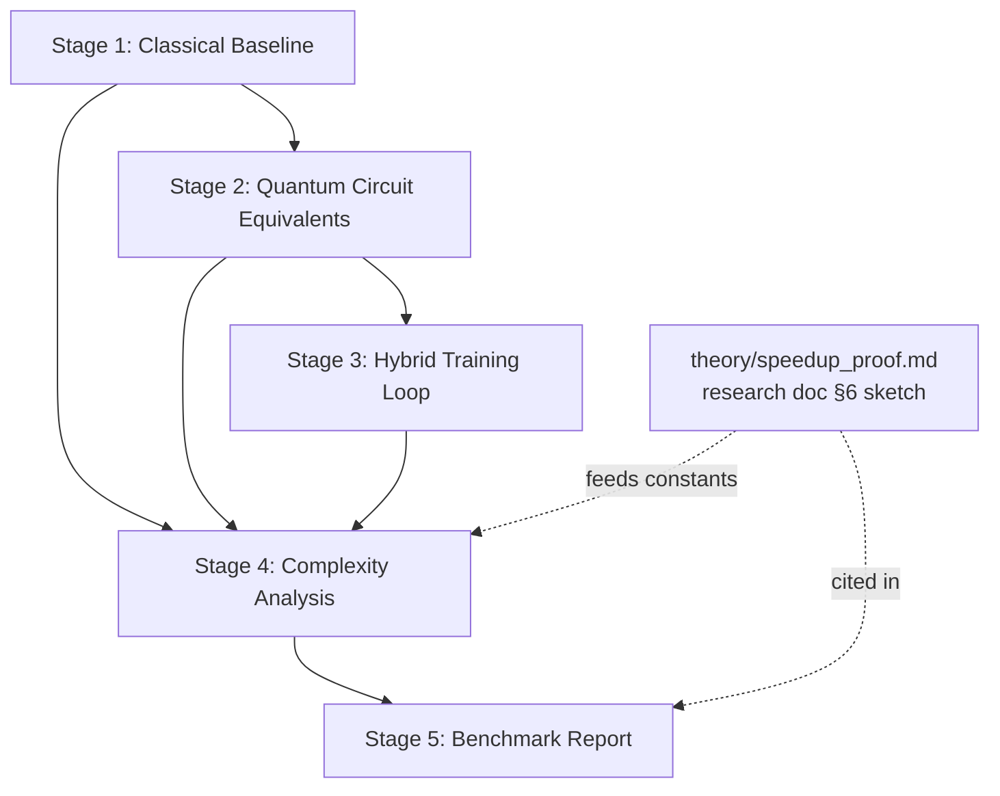

# WORKFLOW: Quantum LLM Training Accelerator

This document defines the step-by-step development process for the `qml-accelerator` sub-project. It operationalizes the findings of the research document [QML-Accelerator — Quantum Acceleration of LLM Training: Theoretical Foundations](../research/01-qml-accelerator.md) into five buildable stages. Nothing in this workflow asserts a practical quantum speedup: the research doc's headline finding (readiness 2/10; no credible path before the mid-2030s) is the operating assumption. The goal of the codebase is to **measure honestly** — build the classical baseline, build the quantum equivalents at simulable scale, and quantify exactly where and why the quantum side loses, using the same epistemic tags (**[Proven]**, **[Demonstrated]**, **[Theoretical]**, **[Speculative]**) as the research doc.

## Prerequisites

| Requirement | Version / Detail | Purpose |
|---|---|---|
| Python | ≥ 3.11 | All simulation and benchmark code |
| PyTorch | ≥ 2.3 | Classical transformer, autograd, profiler |
| PennyLane | ≥ 0.38 | Quantum circuit construction, parameter-shift gradients, PyTorch interface (arXiv:1811.04968, research doc §5) |
| pennylane-lightning | ≥ 0.38 | `lightning.qubit` fast statevector simulator (practical ceiling ~30 qubits dense, per research doc §5) |
| NumPy, SciPy | ≥ 1.26 / ≥ 1.11 | Numerics, condition-number estimation |
| matplotlib | ≥ 3.8 | Crossover and speedup charts |
| pytest | ≥ 8 | Acceptance tests per stage |

Pin exact versions in `qml-accelerator/requirements.txt` as the first commit of Stage 1.

**Prior reading (mandatory):**

1. The full research doc, especially §2.0 (query-model translation losses), §6 (the O(√N) sketch and assumptions A1–A4), and §7 (hardware accounting).
2. Aaronson, "Read the fine print" (Nature Physics 2015) — the five HHL caveats are load-bearing for Stage 2.
3. PennyLane docs on the parameter-shift rule and the PyTorch interface (`qml.qnode(dev, interface="torch")`).

**Ground rules carried over from the research doc:**

- Every README, docstring, and report produced by these stages must tag claims with the four-tag convention.
- Anything the research doc marks **[Speculative]** (qRAM/A1, coherent autodiff oracle/A2, end-to-end advantage) is modeled as a *labeled assumption with a tunable constant* in code — never silently treated as free.
- Simulator-measured wall-clock times of quantum circuits are **not** evidence about quantum hardware speed and must never be plotted as such; they validate correctness only.

## Stage 1: Classical Baseline

**Objective:** Produce a profiled, reproducible classical transformer training baseline whose per-operation timings anchor every later comparison.

**Steps:**

1. Create `qml-accelerator/simulations/classical_transformer.py` implementing `MinimalTransformer(n_layers=4, d_model=128, n_heads=8)` in pure PyTorch (no `nn.Transformer` shortcut — we need to instrument each op). Modules: `QKVProjection`, `ScaledDotProductAttention`, `MLP` (4× expansion, matching the research doc §4.0 accounting), `OutputHead`.
2. Implement `make_synthetic_dataset(vocab_size=512, seq_len=64, n_examples=8192, seed=42)` — a next-token prediction task over synthetic sequences with a learnable structure (e.g., k-th order Markov source), so loss curves are meaningful.
3. Implement `train(model, dataset, batch_size=64, steps=500)` with AdamW and cross-entropy loss; assert the loss decreases ≥ 30% from step 0 to step 500 (sanity check that the baseline actually learns).
4. Instrument per-operation timing with `torch.profiler` plus explicit `time.perf_counter()` wrappers around the four target ops: **attention QKV matmul**, **softmax**, **MLP**, and **gradient update** (backward + optimizer step). Record mean/p50/p95 over the steady-state window (steps 100–500), plus FLOP estimates from the research doc §4.0 formulas (O(B·L·d_model²) for QKV/MLP, O(B·L²·d_model) for attention scores).
5. Write `dump_baseline(path)` emitting `qml-accelerator/benchmarks/classical_baseline.json` with schema: `{hardware, torch_version, model_config, op_timings: {qkv_matmul, softmax, mlp, grad_update}, flop_estimates, loss_curve}`.
6. Add `qml-accelerator/simulations/tests/test_classical_transformer.py` covering shape correctness, loss decrease, and JSON schema validity.

**Deliverables:**

- `qml-accelerator/simulations/classical_transformer.py`
- `qml-accelerator/simulations/tests/test_classical_transformer.py`
- `qml-accelerator/benchmarks/classical_baseline.json`
- `qml-accelerator/requirements.txt`

**Acceptance criteria:**

- `python qml-accelerator/simulations/classical_transformer.py --profile` runs end-to-end and writes `classical_baseline.json`.
- JSON contains all four op-timing keys with nonzero p50 values and FLOP estimates consistent (±20%) with the §4.0 formulas.
- `pytest qml-accelerator/simulations/tests/` passes; training loss decreases ≥ 30%.
- Two runs with the same seed produce op timings within 10% of each other (reproducibility).

## Stage 2: Quantum Circuit Equivalents

**Objective:** Implement a PennyLane circuit equivalent for each profiled classical op, documenting qubit count and gate depth honestly — including the state-preparation and readout costs the research doc §4.4 identifies as the dominant walls.

**Steps:**

1. Create `qml-accelerator/simulations/quantum_attention.py` with one class per target op, each exposing `.circuit()`, `.qubit_count()`, `.gate_depth()`, and `.resource_report()`:
   - `HHLMatVec` — matrix-vector multiply via HHL (research doc §2.3) at toy scale: 2×2 and 4×4 Hermitian systems (1–2 system qubits + clock register + ancilla, ≤ 8 qubits total). The class must compute and report κ (condition number) and refuse (raise `HHLCaveatViolation`) when inputs violate the preconditions — non-sparse structure or κ above a configurable bound — mirroring the five Aaronson caveats. Docstring must state that the output is a quantum state, that classical readout of all N entries costs Ω(N) tomography samples **[Proven]**, and that end-to-end advantage is **[Speculative]**.
   - `QuantumSoftmaxSampler` — softmax *approximation* via amplitude-encoded logits and measurement sampling: encode normalized exp-logits into amplitudes, estimate the distribution from S shots, report total-variation distance vs. exact softmax as a function of S. Docstring tags this construction **[Theoretical]** as an estimation primitive and notes the per-entry statistical error behaves like multiplicative noise on every matmul (research doc §4.2); amplitude encoding of 2ⁿ arbitrary values costs O(2ⁿ) gate depth **[Proven]** (research doc §3.1) and must be counted in `resource_report()`.
   - `ParameterShiftGradient` — gradient estimation for a small VQC (4–8 qubits, 2–3 layers, local cost function per Cerezo et al. to stay clear of barren plateaus, research doc §3.3–3.4) using the exact parameter-shift rule ∂C/∂θ_k = ½[C(θ_k+π/2) − C(θ_k−π/2)] **[Proven]**. Must count and report the O(d) circuit executions per gradient step and O(1/ε²) shots per expectation value — the inverted economics vs. classical reverse-mode (research doc §3.1).
2. For each op, generate a resource table row: logical qubits, two-qubit gate depth, state-prep gate count, readout sample count at ε ∈ {10⁻¹, 10⁻², 10⁻³}.
3. Validate each circuit on `default.qubit` against the classical op at toy dimensions (e.g., HHL solution fidelity ≥ 0.99 for κ ≤ 5; softmax TV distance ≤ 0.05 at S = 10⁴ shots).
4. Write the resource documentation into `qml-accelerator/simulations/quantum_attention_resources.md` (a table per op, every row tagged), explicitly noting which costs are hidden in the query model per research doc §2.0.
5. Add `qml-accelerator/simulations/tests/test_quantum_attention.py`.

**Deliverables:**

- `qml-accelerator/simulations/quantum_attention.py`
- `qml-accelerator/simulations/quantum_attention_resources.md`
- `qml-accelerator/simulations/tests/test_quantum_attention.py`

**Acceptance criteria:**

- All three op classes simulate correctly on `default.qubit` at toy scale and pass the fidelity/TV-distance thresholds above.
- `resource_report()` output includes state-prep and readout costs — a report listing only the polylog "core" gate count fails review.
- `HHLMatVec` raises `HHLCaveatViolation` on an ill-conditioned (κ > bound) input — caveat enforcement is tested, not just documented.
- `quantum_attention_resources.md` exists, contains one resource table per op, and every quantitative claim carries a tag consistent with the research doc.

## Stage 3: Hybrid Training Loop

**Objective:** Build a working hybrid loop — classical forward pass, quantum gradient estimation for a designated parameter subset, classical weight update — on a quantum simulator.

**Steps:**

1. Create `qml-accelerator/simulations/hybrid_training_loop.py` defining `HybridModel`: the Stage 1 transformer with one attention head's small projection (or a VQC adapter head, per the research doc §5 "tractable today" item (ii)) replaced by a PennyLane QNode with `interface="torch"`, so PyTorch autograd flows through the parameter-shift rule automatically.
2. Restrict the quantum block to ≤ 16 qubits and depth O(log n) with local cost functions, citing the barren-plateau constraint (research doc §3.3–3.4) in the module docstring.
3. Implement `train_hybrid(model, dataset, device_name)` supporting `default.qubit` and `lightning.qubit`; use `lightning.qubit` with adjoint differentiation for speed, but log a prominent note that adjoint O(1)-sweep amortization exists **only on classical simulators**, not hardware (research doc §3.1) — hardware economics remain O(d/ε²).
4. Implement a shot-based mode (`shots=1024`) alongside the analytic mode, so the measured gradient-variance gap between the two is itself a recorded result.
5. Run a control experiment: identical architecture with the quantum block replaced by a classical MLP of matched parameter count. The research doc predicts an expected null result — the hybrid model matching, not beating, the control is the anticipated outcome and must be reported as such.
6. Log per-step wall-clock, gradient variance, and number of circuit executions to `qml-accelerator/benchmarks/hybrid_run_log.json`.
7. Add `qml-accelerator/simulations/tests/test_hybrid_training_loop.py` (gradient flow through the QNode; loss decreases on the synthetic task in analytic mode).

**Deliverables:**

- `qml-accelerator/simulations/hybrid_training_loop.py`
- `qml-accelerator/simulations/tests/test_hybrid_training_loop.py`
- `qml-accelerator/benchmarks/hybrid_run_log.json`

**Acceptance criteria:**

- `python qml-accelerator/simulations/hybrid_training_loop.py --device lightning.qubit --steps 200` completes and writes `hybrid_run_log.json`.
- Hybrid loss decreases on the synthetic task; gradients reach quantum parameters via `loss.backward()` (verified by a non-None `.grad` assertion in tests).
- The run log records circuit-execution counts demonstrating the O(d) executions-per-step scaling in shot-based mode.
- The classical-control comparison is present in the log; no claim of hybrid superiority appears unless it exceeds the control by > 2σ across ≥ 5 seeds (it is expected not to).

## Stage 4: Complexity Analysis

**Objective:** Produce the op-by-op complexity comparison and crossover analysis, faithfully reproducing the research doc's accounting — including the d-factor, I/O costs, and the 10⁸–10¹⁰× clock-rate deficit that dominate the wall-clock verdict.

**Steps:**

1. Create `qml-accelerator/benchmarks/complexity_analysis.py` with a declarative `OPS` table encoding, for each op, the classical and quantum cost models from the research doc Tables 1–3: e.g., matvec — classical O(n²) vs. HHL Õ(log N·s²κ²/ε) *state output only*; mean estimation — classical Θ(1/ε²) vs. QAE O(1/ε); gradient step — classical O(N·C_f) full-batch / O(B·C_f) SGD vs. quantum O(d·√N·Õ(C_f)) per the §6 sketch.
2. Implement `crossover(op, constants)` computing the N at which the quantum cost model undercuts the classical one, under explicit, printed constants: oracle-synthesis overhead 10²–10⁴ (**[Theoretical]**, §2.0), logical clock 10⁴–10⁶ ops/s vs. ~1.5×10¹⁴ effective FLOP/s on an A100 (§7.1), readout Ω(n/ε²) where classical output is required.
3. Generate two chart families with matplotlib into `qml-accelerator/benchmarks/figures/`:
   - **Query-model curves** (`speedup_query_model.png`): the clean O(√N)-vs-O(N) and O(1/ε)-vs-O(1/ε²) asymptotics, labeled "query complexity under A1–A4 — **[Theoretical]**".
   - **Wall-clock-adjusted curves** (`crossover_wall_clock.png`): the same comparisons after applying the clock deficit, oracle constants, and the d-factor. Per research doc §6.5, the gradient-step crossover requires N ≫ 10¹⁴–10¹⁶ when d ≈ 10⁷–10⁸ — the chart must show this, and the honest finding is that **no realistic crossover exists**; axes must extend far enough to make that visible rather than cropping to flatter a curve.
4. Emit `qml-accelerator/benchmarks/complexity_table.md`: one row per op with O(classical), O(quantum), preconditions, output form, and status tag — column-compatible with research doc Tables 1–3 so discrepancies are mechanically checkable. Note: the matvec row's classical baseline here is the dense matvec *op* (O(n²)), whereas research doc Table 1 frames HHL against conjugate gradient at O(N·s·κ) — a linear *solve* to state vector. Both are correct in their own framing; the table must carry an explicit framing annotation on this row so a mechanical Table 1 comparison does not flag a false mismatch.
5. Cross-check: a `--verify` flag asserts the script's symbolic cost models match the research doc's stated complexities (hard-coded expected strings), failing CI on drift. The matvec row's expected strings must encode the step 4 framing difference (matvec O(n²) here vs. Table 1's O(N·s·κ) CG solve baseline) rather than asserting an exact Table 1 match.
6. Write `qml-accelerator/theory/speedup_proof.md`: the engineering rendition of the research doc §6 proof sketch — restate assumptions A1 (qRAM, **[Speculative]**), A2 (coherent autodiff oracle, **[Speculative]**), A3 (amplitude encoding, **[Theoretical]**), A4 (readout granularity, **[Theoretical]**); reproduce the QGE-ATTN pseudocode and the O(d·√N·Õ(C_f)) claim; and map each assumption to the code constant in `complexity_analysis.py` that models it. This file is the theory deliverable tied to the research doc's proof sketch and must carry the same overall label: **[Theoretical]** complexity accounting, **[Speculative]** hardware assumptions, not a feasibility claim.

**Deliverables:**

- `qml-accelerator/benchmarks/complexity_analysis.py`
- `qml-accelerator/benchmarks/complexity_table.md`
- `qml-accelerator/benchmarks/figures/speedup_query_model.png`
- `qml-accelerator/benchmarks/figures/crossover_wall_clock.png`
- `qml-accelerator/theory/speedup_proof.md`

**Acceptance criteria:**

- `python qml-accelerator/benchmarks/complexity_analysis.py --verify` exits 0 (cost models match the research doc) and regenerates both figures and the table.
- `complexity_table.md` contains every op from `classical_baseline.json` with status tags matching the research doc Tables 1–3.
- The wall-clock chart shows no quantum/classical crossover for the gradient-step op at any N ≤ 10¹⁴, and the figure caption states the d ≪ √N condition from §6.5.
- `speedup_proof.md` lists all four assumptions A1–A4 with their tags and includes the per-update cost comparison table (research doc Table 3) verbatim or equivalent.

## Stage 5: Benchmark Report

**Objective:** Extrapolate measurements to the 1B-parameter scale and publish the consolidated benchmark report, reproducing — not softening — the research doc's wall-clock verdict.

**Steps:**

1. Create `qml-accelerator/benchmarks/extrapolate_1b.py`: scale the Stage 1 op timings to a 1B-parameter transformer using the §4.0 FLOP formulas and the 6P-FLOPs-per-token rule (§7.1), and scale the quantum cost model using the Stage 4 constants plus the §7 hardware floors (≈ 4×10³ logical qubits, logical error ≤ 10⁻¹², ≈ 3×10⁷ physical qubits at Λ ≈ 2.14, code distance ≈ 63). Output `qml-accelerator/benchmarks/extrapolation_1b.json`.
2. The extrapolation must reproduce the research doc Table 4 verdict for the 1B row: the quantum subroutine **loses by ≥ 8 orders of magnitude** in wall-clock at 10⁴–10⁶ logical ops/s. If the script disagrees with Table 4 by more than one order of magnitude, treat it as a bug in the script or a flagged erratum against the research doc — file an issue either way; do not silently publish the divergent number.
3. Write `qml-accelerator/benchmarks/benchmark_report.md` assembling: (a) Stage 1 baseline table from `classical_baseline.json`; (b) Stage 2 resource tables; (c) Stage 3 hybrid-vs-control result (including the expected null); (d) Stage 4 figures and complexity table; (e) the 1B extrapolation with its assumptions enumerated and tagged; (f) a conclusion section that restates the research doc's readiness score (2/10) and the four walls (qRAM, I/O costs, the d-factor, clock deficit) — and lists the research doc §8 tracking signals that would trigger re-evaluation.
4. Embed the Stage 4 figures with relative links and include a "Reproduction" appendix: exact commands to regenerate every number in the report from a clean checkout.
5. Final consistency pass: grep the report for the words "speedup" and "advantage" and confirm each occurrence is qualified with a tag and scope (query-model vs. wall-clock).

**Deliverables:**

- `qml-accelerator/benchmarks/extrapolate_1b.py`
- `qml-accelerator/benchmarks/extrapolation_1b.json`
- `qml-accelerator/benchmarks/benchmark_report.md`

**Acceptance criteria:**

- `python qml-accelerator/benchmarks/extrapolate_1b.py` runs from a clean checkout (given Stage 1–4 artifacts) and writes `extrapolation_1b.json`.
- The 1B wall-clock comparison in the report agrees with research doc Table 4 (quantum loses by ≥ 8 orders of magnitude) within one order of magnitude.
- `benchmark_report.md` contains: at least one chart, the complexity table, the hybrid-vs-control result, the readiness score 2/10, and the reproduction appendix.
- No untagged speedup/advantage claim survives the Step 5 grep pass.

## Stage Dependency Graph

Stages 2 and 4 can begin in parallel once Stage 1's `classical_baseline.json` is frozen; Stage 4's crossover constants are finalized only after Stage 2's resource reports and Stage 3's execution counts land.

## Risks & Open Questions

| # | Risk / question | Source in research doc | Tag | Mitigation in this workflow |
|---|---|---|---|---|
| 1 | qRAM (assumption A1) does not exist at any scale; all O(√N) gradient results are conditional on it | §6.2, §6.6 | **[Speculative]** | Modeled as an explicit named constant in `complexity_analysis.py`; never treated as free |
| 2 | Coherent autodiff oracle (A2) carries 10²–10⁴ reversible-compilation constants | §2.0, §6.2 | **[Speculative]** | Constant swept over its full range in crossover charts |
| 3 | The d-factor: one QAE per component vs. backprop's O(1)-sweep makes the sketch lose for any real model (d ≈ 10⁷–10⁸ needs N ≫ 10¹⁴) | §6.5(1) | **[Proven]** arithmetic | Stage 4 must display this, not bury it |
| 4 | The honest classical baseline is minibatch SGD, not full-batch GD; quantum advantage over a straw man is not advantage | §6.5(2) | **[Theoretical]** objection | Both baselines appear in `complexity_table.md` |
| 5 | Clock deficit of 10⁸–10¹⁰× (logical ops/s vs. A100 FLOP/s) must be repaid before any quadratic gain | §2.0(3), §7.1 | **[Demonstrated]** physical cycle times, **[Theoretical]** logical-rate extrapolation, **[Proven]** consequence | Wall-clock charts apply it by default; query-model charts are separately labeled |
| 6 | HHL caveats (state prep, readout, κ², sparsity, dequantization) can each erase the advantage | §2.3, [4], [5] | **[Proven]** | `HHLCaveatViolation` enforcement + tests in Stage 2 |
| 7 | Barren plateaus: random deep VQCs are untrainable (shot cost Ω(2ⁿ)) | §3.3 | **[Proven]** | Stage 3 restricted to local cost functions, depth O(log n), ≤ 16 qubits |
| 8 | Quantum softmax via sampling injects per-entry statistical noise harsher than deterministic rounding; end-to-end trainability with it is unestablished | §4.2 | **[Theoretical]**, end-to-end **[Speculative]** | TV-distance-vs-shots measurement in Stage 2; not used inside Stage 3's training path |
| 9 | Statevector simulation ceiling (~30 qubits) means nothing here measures hardware behavior; simulator timings could be misread as hardware evidence | §5 | **[Demonstrated]** state of practice | Ground rule: simulator wall-clock never plotted as hardware performance |
| 10 | Open: does any trainable-yet-classically-hard VQC family with a learning advantage exist? | §3.4 closing note | **[Speculative]** either way | Stage 3's matched-parameter control experiment contributes a data point, expected null |
| 11 | Open: all-components quantum gradient methods (sublinear in d) would change the calculus, but have no fault-tolerant resource analysis | §6.6(1) | **[Speculative]** | Tracked as a research-doc §8 tracking signal; not built upon |

Re-evaluate this workflow (and the readiness score it inherits) when any research doc §8 tracking signal fires — notably >10 logical qubits executing >10⁶ logical gates at logical error <10⁻⁸, or any peer-reviewed qRAM demonstration beyond ~10³ cells.
