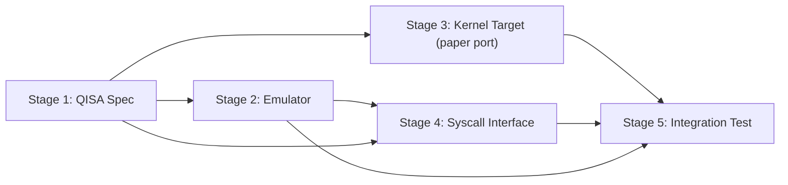

# WORKFLOW: Linux-on-Quantum Port

This document defines the step-by-step engineering process for building out the `quantum-linux/` codebase. It operationalizes the findings of the research study [QuantumLinux — Porting the Linux Kernel to a Quantum Architecture](../research/02-quantum-linux.md). That study's verdict is binding on this workflow: a literal port of Linux *onto* qubits is infeasible in principle (a corollary of the **[Proven]** no-cloning theorem and measurement postulate), while Linux as the classical *control plane* of a QPU is **[Demonstrated]** practice on every deployed system. Stages 1–2 build the QISA-K toolchain and emulator; Stage 3 is deliberately a *paper port* whose deliverable is the documented list of break points, not a bootable kernel; Stages 4–5 build the hybrid dispatch interface (`QALLOC`/`QEXEC`/`QMEASURE`/`QFREE`) the research doc identifies as the only viable design.

## Prerequisites

| Requirement | Version / detail | Purpose |
|---|---|---|
| Python | ≥ 3.11 | Emulator, shim, tests |
| NumPy | ≥ 1.26 | Statevector simulation (`complex128`) |
| PyYAML | ≥ 6.0 | Loading/validating `QISA-v0.1.yaml` |
| pytest | ≥ 8.0 | Test runner for all `test_*.py` files |
| GCC or Clang | any C11-capable | Compile-checking `qsyscall.h` and the userspace test |
| Linux kernel source | 6.12 LTS tree (read-only reference; do **not** vendor it into this repo) | Stage 3 subsystem audit |
| Prior reading | [research doc](../research/02-quantum-linux.md); eQASM (arXiv:1808.02449); OpenQASM 3 (arXiv:2104.14722); QIR Alliance spec | ISA and syscall design lineage |

Practical sizing note before starting: dense statevector simulation stores 2^n `complex128` amplitudes (16·2^n bytes), so the emulator is realistic to ~24 qubits on a laptop (≈256 MB) and the test suite should target ≤ 12 qubits. This is an emulator-capacity limit, distinct from the **[Proven]** Θ(4^n/ε²) tomography cost that forbids *serializing* unknown quantum state — do not conflate the two in docs or commit messages.

## Stage 1: QISA Specification

**Objective:** Encode the research doc's QISA-K instruction set as a machine-readable YAML spec plus a formal prose spec, reusing its exact gate set, register naming, and 32-bit encoding sketches.

**Steps**

1. Create `quantum-linux/isa-spec/QISA-v0.1.yaml` with top-level keys: `meta`, `registers`, `instructions`, `verifier_rules`. Set `meta.name: QISA-K`, `meta.version: 0.1`, `meta.lineage: [eQASM, OpenQASM3, QIR]`.
2. Under `registers`, define the research doc's register model verbatim: quantum registers `q0 … qN-1` (physical resource names — no load/store, no pointer arithmetic, no aliasing), classical shadow registers `c0 … cN-1` (the only context-switchable state), and classical GPRs (`r*`) for the `FMR`/branch path. Mark quantum registers `linear: true` (use-at-most-once, consumed by `MEASURE`/`RESET`).
3. Under `instructions`, transcribe the research doc's opcode table exactly — `H`, `X`, `Y`, `Z`, `S`, `T`, `RX(θ)`, `RY(θ)`, `RZ(θ)`, `CNOT`, `CZ`, `MEASURE q -> c`, `RESET`, `FMR c -> GPR`, `QWAIT cycles` — each entry carrying `operands`, `unitary: true|false`, `semantics`, and the 32-bit `encoding` field from the table (e.g. `CNOT: "[8b op][12b qc][12b qt]"`; `RX`: θ as 16-bit fixed-point or 10-bit LUT index, after eQASM). Add `BRN reg, label` as the classical control-flow instruction used by the research doc's Bell-pair listing.
4. Under `verifier_rules`, encode the static rules the research doc assigns to the syscall verifier — `no-gate-on-unleased-qubit` and `no-use-after-measure-without-RESET` — plus one workflow addition (not in the research doc's verifier list, but a natural extension of its linear-resource discipline): `no-qubit-operand-duplication-in-copy-position` (e.g. rejects `CNOT q0, q0`). The research doc's third `-ENOEXEC` cause, malformed QIR, is handled at the Stage 4 blob-parsing layer rather than as a YAML rule. These rules are reused by Stage 2 (decoder) and Stage 4 (`-ENOEXEC` path).
5. Write `quantum-linux/isa-spec/QISA-v0.1.md`: register model, full instruction table (same columns as the research doc: Opcode / Operands / Semantics / Unitary? / Encoding), assembly syntax, the worked Bell-pair-with-feed-forward example copied from the research doc, and a "Limitations & realism" section. That section MUST state: (a) feed-forward branches (`BRN` after `FMR`) resolve in control firmware, not OS code, because the branch must complete inside the coherence window **[Demonstrated]** (eQASM, QNodeOS); (b) a production QISA would also need SIMD "same gate, many qubits" formats and VLIW timing slots, as eQASM found **[Demonstrated]** — out of scope for v0.1.
6. Add a loader sanity check, documented at the bottom of the YAML's doc header (or as a `Makefile` target): `python -c "import yaml; yaml.safe_load(open('quantum-linux/isa-spec/QISA-v0.1.yaml'))"` must exit 0.

**Deliverables**

- `quantum-linux/isa-spec/QISA-v0.1.yaml`
- `quantum-linux/isa-spec/QISA-v0.1.md`

**Acceptance criteria**

- YAML parses with `yaml.safe_load` and contains all 15 opcodes from the research doc's table plus `BRN`; every instruction has `unitary` and `encoding` fields.
- `QISA-v0.1.md` contains the instruction table, the Bell-pair listing, and an explicit statement that shadow registers are the only context-switchable machine state.
- Diffing the opcode list against the research doc's table shows no renames, no additions beyond `BRN`, no missing entries.

## Stage 2: Quantum CPU Emulator

**Objective:** Implement a NumPy statevector emulator that decodes QISA-K, executes circuits, and maintains a classical register file — the reference backend for all later stages.

**Steps**

1. Create `quantum-linux/emulator/qcpu.py` with classes: `ISA` (loads and validates `../isa-spec/QISA-v0.1.yaml`), `ClassicalRegisterFile` (shadow registers `c[]` + GPRs `r[]`, plain ints), and `QCPU`.
2. `QCPU.__init__(n_qubits, seed=None)`: allocate `self.state = np.zeros(2**n_qubits, dtype=np.complex128)` initialized to |0…0⟩; cap `n_qubits ≤ 24` with a clear error message citing the 16·2^n memory cost.
3. Implement `apply_1q(gate_matrix, q)` and `apply_2q(gate_matrix, qc, qt)` via reshape/`np.einsum` (not full 2^n×2^n Kronecker products). Define the gate matrices for H, X, Y, Z, S, T, RX/RY/RZ(θ), CNOT, CZ exactly per the spec.
4. Implement non-unitary ops: `measure(q, c)` — compute P(0/1) from amplitudes, sample with `numpy.random.Generator`, project and renormalize, write outcome to shadow register `c` (destructive: matches the **[Proven]** measurement postulate, no peeking API); `reset(q)` as measure + conditional X, per the spec's RESET semantics.
5. Implement the classical side: `fmr(c, r)`, `qwait(cycles)` (advances a cycle counter — the emulator is not timing-accurate; the counter exists so Stage 5 can report simulated cycle totals), and `brn(r, label)` over a decoded program with labels.
6. Implement `QCPU.run(program)` — a decode loop over assembly text (or the YAML-driven binary encoding, stretch goal) that enforces the Stage 1 verifier rules *before* execution and raises `QISAVerifierError` on use-after-measure or out-of-range qubit operands.
7. Instrument counters: `gate_counts` (per-opcode dict), `two_qubit_gate_count`, `measure_count`, `cycle_counter`. Stage 5 consumes these.
8. Write `quantum-linux/emulator/test_hello_quantum.py` (pytest) with two canonical programs plus a verifier test:
   - *Correlation test* — the **uncorrected** Bell circuit (`RESET q0; RESET q1; H q0; CNOT q0, q1; MEASURE q0 -> c0; MEASURE q1 -> c1` — the research doc's listing with the `FMR`/`BRN`/`X` feed-forward path removed): run 4096 shots; assert (a) `c0 == c1` in every shot, (b) marginal of `c0` is ~50/50 within 5σ.
   - *Feed-forward determinism test* — the research doc's Bell-pair-with-feed-forward listing assembled verbatim: run 4096 shots; assert (a) `c1` is the **same constant value in every shot** (the conditional-X correction is the teleportation disentangling step, so q1 collapses deterministically — `c0 == c1` does *not* hold here and must not be asserted), (b) marginal of `c0` is ~50/50 within 5σ.
   - *Verifier test* — a deliberately corrupted program with `H q0` after `MEASURE q0` (no RESET) raises `QISAVerifierError`.

**Deliverables**

- `quantum-linux/emulator/qcpu.py`
- `quantum-linux/emulator/test_hello_quantum.py`

**Acceptance criteria**

- `pytest quantum-linux/emulator/test_hello_quantum.py` passes; the uncorrected Bell circuit produces correlated classical output (`c0 == c1` for all shots) with a ~uniform `c0` marginal, and the feed-forward listing produces a constant `c1` across all shots with a ~uniform `c0` marginal.
- Emulator exposes no API for reading amplitudes from "kernel-visible" paths — classical results flow only through MEASURE→shadow→FMR, mirroring the research doc's rule that only the classical shadow crosses any boundary. (A `_debug_statevector()` accessor is permitted for tests, named to make its unphysicality obvious.)
- Verifier rejects use-after-measure statically (test asserts this).

## Stage 3: Minimal Kernel Target

**Objective:** Perform the literal-port thought experiment honestly: audit five small kernel subsystems against QISA-K, write the `arch/quantum/` skeleton as annotated C/pseudocode, and document every break point — confirming, not contradicting, the research doc's class-D findings.

Framing note (binding): the research doc proves the literal port fails at theorem level and that running kernel control flow on qubits would be strictly worse than pointless (full QEC overhead, ~10³ physical qubits per logical qubit **[Demonstrated]** trendlines, zero algorithmic gain). Stage 3's product is therefore *documentation and pseudocode that pinpoints where each subsystem breaks*, plus the surviving classical-control-plane skeleton. No buildable kernel is expected or attempted.

**Steps**

1. Obtain a read-only Linux 6.12 LTS source tree (e.g. `git clone --depth 1 --branch v6.12 https://git.kernel.org/pub/scm/linux/kernel/git/stable/linux.git /tmp/linux-6.12`). Reference it; do not commit it.
2. Select and justify the five most portable subsystems, per the research doc's most portable (class-A/B) rows: minimal arch layer (`arch/*/kernel/head*.S` analogue), `init/main.c` (`start_kernel`), `printk`, a basic run-to-completion scheduler stub, and timekeeping (`kernel/time/`). Record LOC and dependency fan-out for each in the notes file.
3. Create `quantum-linux/kernel-patches/arch-quantum-notes.md` with one section per subsystem: what x86 does, what QISA-K can and cannot express, and the verdict keyed to the research doc's A/B/C/D classes (boot/init: A on the classical host; scheduler: B — EDF/batch admission replaces CFS time-slicing because preemption of a running circuit is **[Proven]** impossible; timekeeping: A and *more* critical, since gate scheduling is deterministic-time).
4. Sketch `arch/quantum/` as pseudocode files *inside* `quantum-linux/kernel-patches/arch-quantum/` (e.g. `head.qS` in QISA-K assembly where expressible, `setup.c` in C pseudocode): boot entry, "CPU" feature probe (qubit count, T1/T2 from a calibration table), and the trap into the class-D wall — annotate the exact first line where each of `fork`/CoW/swap/`ptrace` support would be required and is **[Proven]** unimplementable for quantum state (no-cloning; measurement postulate; Θ(4^n/ε²) tomography).
5. End `arch-quantum-notes.md` with a "Changes vs x86" table (one row per file touched in a real arch port: `Kconfig`, `head.S`, `setup.c`, `entry.S`, `pgtable.h`, …) and a closing recommendation that redirects effort to the Stage 4 hybrid interface, citing the research doc's verdict.

**Deliverables**

- `quantum-linux/kernel-patches/arch-quantum-notes.md`
- `quantum-linux/kernel-patches/arch-quantum/` (pseudocode skeleton: `head.qS`, `setup.c`, `Kconfig.notes`)

**Acceptance criteria**

- `arch-quantum-notes.md` contains: the five-subsystem audit with per-subsystem A/B/C/D verdicts consistent with the research doc's classification table; the "Changes vs x86" table; explicit claim tags ([Proven]/[Demonstrated]) on every physics-based impossibility claim.
- No deliverable claims or implies a bootable quantum kernel; the word "pseudocode" appears in the header of every file in `arch-quantum/`.
- Every class-D verdict in the notes matches the research doc's table (`fork`, CoW, swap/demand paging, page cache/KSM/snapshots, `ptrace`/core dumps) — zero reclassifications without a written justification.

## Stage 4: Quantum Syscall Interface

**Objective:** Specify the four-call hybrid dispatch interface from the research doc as a C header, implement a classical emulation shim over the Stage 2 emulator, and document the classical↔quantum context-switch protocol.

**Steps**

1. Write `quantum-linux/kernel-patches/qsyscall.h` reproducing the research doc's syscall table exactly: `int qalloc(int qpu_fd, unsigned n_qubits, struct qalloc_hints *h)`; `int qexec(int qset_fd, const void *qir_blob, size_t len, struct qexec_params *p)`; `ssize_t qmeasure(int qset_fd, void *out, size_t out_len)`; `int qfree(int qset_fd)`. Define `struct qalloc_hints` (`min_t2_us`, `topology`) and `struct qexec_params` (`shots`, `deadline`, `fidelity_floor`) per the research doc's userspace flow.
2. Encode the error contract as header comments and `#define`s, matching the research doc's errno table: `-EBUSY` (pool exhausted — no overcommit, ever, because no swap exists), `-ETIME` (depth exceeds coherence/QEC budget), `-ENOEXEC` (verifier rejection), `-EIO` (below fidelity floor), `-ESTALE` (placement invalidated by recalibration), `-EPERM` (`dup`/`mmap`/`sendfile` on a qset fd — copying or non-destructive observation, physically undefined).
3. Document the linear-capability invariants in the header: qset fds are close-on-fork (move semantics, at most one owner), `dup()` → `-EPERM`, `mmap()` rejected, `qexec` blobs statically verified using the Stage 1 `verifier_rules`.
4. Implement the shim: `quantum-linux/emulator/qsyscall_shim.py`, a Python class `QSyscallShim` exposing `qalloc/qexec/qmeasure/qfree` with the same semantics and errno returns (as negative ints), backed by `QCPU`. Enforce single-owner leases, lease-table lookups, verifier-before-execute, and one-shot destructive `qmeasure` (second call on a consumed lease fails).
5. Write the userspace test, `quantum-linux/emulator/test_qsyscall.py`: replays the research doc's userspace flow (lease 2 qubits with `min_t2_us=200`, submit the *uncorrected* Bell correlation program from Stage 2 with `shots=4096`, `fidelity_floor=95`, qmeasure into a buffer, qfree) and exercises every errno path, including double-`qmeasure` and `qexec` on an unleased qubit (`-ENOEXEC`).
6. Compile-check the header: `gcc -fsyntax-only -std=c11 quantum-linux/kernel-patches/qsyscall.h` must pass (guard kernel-only types behind `#ifdef __KERNEL__` or use fixed-width userspace types).
7. Write `quantum-linux/kernel-patches/context-switch-protocol.md`: the protocol by which the classical kernel "context switches" around quantum work. Per the research doc, quantum state itself cannot be saved (**[Proven]** no-cloning) — so the protocol is: (a) shadow registers and lease metadata are the only saved state; (b) running circuits are run-to-completion under EDF admission, never preempted; (c) "suspend/resume" of a quantum job is checkpoint-by-reexecution (store circuit + classical inputs, kill state, re-run later), valid only when preparation is deterministic from classical data; (d) feed-forward latency lives in firmware below the kernel — Linux interrupt latency cannot meet coherence-window deadlines reliably.

**Deliverables**

- `quantum-linux/kernel-patches/qsyscall.h`
- `quantum-linux/qos/QLOS-DESIGN-v0.1.md` §§3–5 (the context-switch / no-preemption protocol)
- `quantum-linux/qos/qsyscalls.py` (layout per `qos/QLOS-DESIGN-v0.1.md` §8)
- `quantum-linux/qos/test_qos.py` (layout per `qos/QLOS-DESIGN-v0.1.md` §8)

**Acceptance criteria**

- Header compiles standalone with `gcc -fsyntax-only`; signatures and struct fields match the research doc's table byte-for-byte at the name level.
- `pytest quantum-linux/emulator/test_qsyscall.py` passes, with at least one assertion per errno in the table (six total) plus the happy path producing 4096 correlated Bell shot pairs (`c0 == c1` in every shot — valid because the submitted program is the uncorrected Bell circuit, not the feed-forward listing).
- `context-switch-protocol.md` states explicitly that no quantum state crosses the syscall boundary — only its classical shadow — and tags the no-preemption rationale [Proven].

## Stage 5: Emulator + Kernel Integration Test

**Objective:** Drive a scripted minimal "kernel init" sequence through the shim and emulator, log gate counts and simulated runtime, and publish the compatibility matrix aligned with the research doc's A/B/C/D table.

**Steps**

1. Write `quantum-linux/emulator/test_kernel_init.py`: a pytest-runnable harness that simulates the Stage 3 init sequence *as the research architecture prescribes* — classical steps (init, printk-style logging, timer ticks, scheduler admission) run as ordinary Python; quantum work is dispatched only through `QSyscallShim`. The init script: probe QPU (qubit count, mock calibration table) → qalloc smoke lease → run the Bell hello-world (the uncorrected correlation variant from Stage 2, whose RESET preamble also feeds the Stage 5 gate-count report) → qmeasure → qfree → report. Do not route classical control flow through the statevector — the research doc shows that gains nothing (**[Proven]** speedups are algorithm-specific) and would misrepresent the architecture.
2. Add a `--report` mode that dumps JSON to `quantum-linux/emulator/results/init-report.json`: per-opcode `gate_counts`, `two_qubit_gate_count`, `measure_count`, `cycle_counter`, shots, wall-clock emulation time, and peak statevector memory.
3. Sanity-check the report against hardware reality: assert `two_qubit_gate_count` per shot ≤ 5,000 — the reliable two-qubit-gate budget of IBM's shipping Nighthawk **[Demonstrated]**. Treat the ~7,500 end-of-2026 figure as roadmap **[Speculative]**: it may appear in a comment, never in an assertion.
4. Write `quantum-linux/kernel-patches/compatibility-matrix.md`: one row per kernel component, columns `Component | Class (A/B/C/D) | Works in this repo? | Mechanism | Research-doc rationale`. Every Class value MUST equal the research doc's classification table (boot/init A; IRQ core A; driver core A; syscall/VFS plumbing A; CFS→EDF scheduler B; qubit allocator B; VM naming layer B; `fork()` for quantum state D; CoW D; swap/demand paging D; page cache/KSM/snapshots D; `ptrace`/core dumps D; filesystems-at-rest C; quantum fds in VFS B; classical net stack A; `AF_QIPC` B; qubit buffering/retransmit/multicast D; isolation B; timekeeping A; power management B; console/ABI A).
5. Map "Works in this repo?" honestly: A-rows → exercised by the Python harness; B-rows → partially modeled by the shim (lease manager, EDF admission stub), **except `AF_QIPC`**, which stays class B but is marked "not modeled in this repo" because quantum networking is excluded entirely (see Risk 8); C-rows → emulated (circuits stored as files, re-execution contracts); D-rows → "not implemented and not implementable — [Proven]" with the specific theorem named.
6. Wire everything into one command: `pytest quantum-linux/` runs Stages 2, 4, and 5 tests green from a clean checkout.

**Deliverables**

- `quantum-linux/emulator/test_kernel_init.py`
- `quantum-linux/emulator/results/init-report.json` (generated artifact; commit one reference copy)
- `quantum-linux/kernel-patches/compatibility-matrix.md`

**Acceptance criteria**

- `pytest quantum-linux/emulator/` passes end-to-end on a clean clone with only the Prerequisites installed.
- `init-report.json` exists and contains non-zero `gate_counts` for H, CNOT, MEASURE, RESET and a `cycle_counter` total.
- `compatibility-matrix.md` contains all 21 rows above with zero class deviations from the research doc; every D-row cites a [Proven] physical law; no row promises future hardware capabilities tagged [Speculative] in the research doc.

## Stage Dependency Graph

Stages 2 and 3 can proceed in parallel once Stage 1 is frozen. Stage 4 needs the emulator (shim backend) and the ISA verifier rules. Stage 5 needs everything.

## Risks & Open Questions

| # | Risk / open question | Source in research doc | Mitigation in this workflow |
|---|---|---|---|
| 1 | Scope creep toward "actually booting Linux on qubits" — impossible at theorem level (no-cloning, measurement postulate, both **[Proven]**) | Verdict section | Stage 3 is locked to paper-port deliverables; acceptance criteria forbid bootable-kernel claims |
| 2 | Emulator capacity (16·2^n bytes) gets confused with the **[Proven]** Θ(4^n/ε²) tomography bound in docs | Memory-model section | Prerequisites note separates the two; reviewers check claim tags |
| 3 | Timing realism: the emulator's `QWAIT` cycle counter is not a coherence model; real feed-forward must beat µs–ms windows **[Demonstrated]** and lives in firmware below Linux | ISA + driver-boundary sections | Stage 1 §5 and Stage 4 §7 document the firmware boundary; no test asserts real-time behavior |
| 4 | Mainline `qpu` subsystem adoption is **[Speculative]** — upstreaming a vendor-neutral char device is the research doc's open problem #1, not a given | Open problems | `qsyscall.h` is written as a design artifact; no upstream submission is scheduled in this workflow |
| 5 | Kernel-enforced linear types (`O_LINEAR` fds) have no existing VFS mechanism — **[Speculative]** research direction | Open problems #2 | Shim enforces single-owner semantics in userspace only; documented as a gap |
| 6 | EDF under calibration drift: coherence deadlines are stochastic, scheduling theory is open **[Theoretical]** | Open problems #3 | Stage 4 admission control uses static deadlines; drift handling deferred, `-ESTALE` path stubs the recalibration event |
| 7 | Hardware sizing assumptions may shift: Nighthawk 5,000 two-qubit gates is **[Demonstrated]**, but ~7,500 (2026) and Starling-class logical-qubit pools (2029) are roadmap **[Speculative]** | ISA realism + conclusion | Assertions pin only to demonstrated figures (Stage 5 §3); speculative figures confined to comments |
| 8 | `AF_QIPC` socket semantics have no reference design **[Speculative]**; quantum networking is out of scope here entirely | Network-stack section, open problem #5 | Explicitly excluded; compatibility matrix marks it B with "not modeled in this repo" |
| 9 | A real backend would need SIMD/VLIW instruction formats (eQASM **[Demonstrated]**); QISA-v0.1 omits them, so per-instruction encodings may not survive contact with hardware | ISA notes-on-realism | Versioned spec (`v0.1`); encoding changes are a spec bump, not silent edits |
