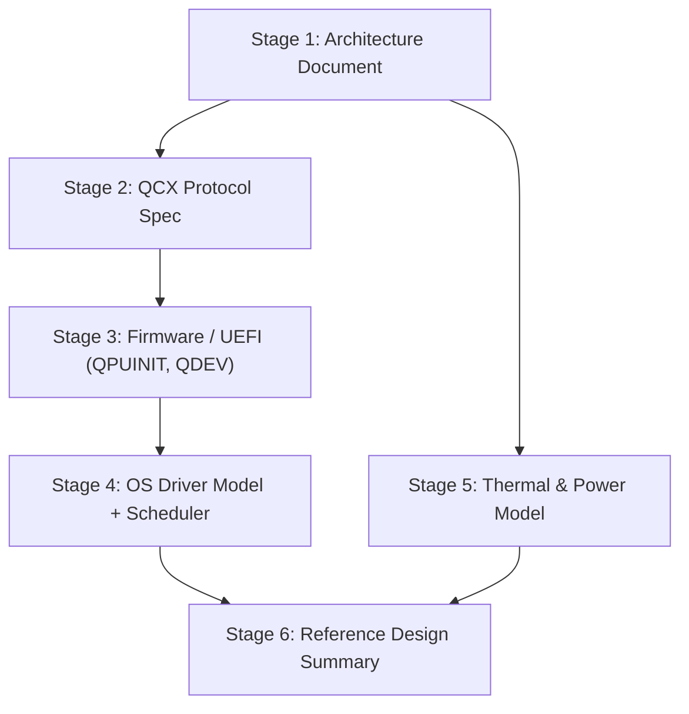

# WORKFLOW: Classical/Quantum Hybrid Motherboard

This document defines the step-by-step development process for building out the `hybrid-board/` tree of this repository. It operationalizes the findings of the feasibility study [03-hybrid-board.md](../research/03-hybrid-board.md): every parameter used below (QCX latency budget, power table, QDEV fields, TRL ratings) is taken from that document and must not drift from it. Where the research doc tags a claim **[Theoretical]** or **[Speculative]**, the artifacts produced here are *design documents and models*, not implementations — the deliverables make that status explicit. The binding design facts to keep in view throughout: the constraint is latency, not bandwidth (≤2 µs QCX loop vs T1 ≈ 160–350 µs **[Demonstrated]**); for superconducting QPUs the "board" is a room; and quantum registers can never appear in the classical address space (**[Proven]**, no-cloning).

## Prerequisites

| Requirement | Version / detail | Used in |
|---|---|---|
| Git | ≥ 2.40 | all stages |
| Python | ≥ 3.11, with `numpy ≥ 1.26`, `matplotlib ≥ 3.8` | Stage 5 |
| C toolchain | `clang ≥ 16` or `gcc ≥ 13` (userspace compile-check only; no kernel build required) | Stage 4 |
| `linux-headers` (optional) | any 6.x series, for struct-layout cross-reference against `platform_driver` | Stage 4 |
| Mermaid CLI (`mmdc`) | ≥ 10.x, to render/validate diagrams | Stage 1 |
| Markdown linter | `markdownlint-cli2` or equivalent | all doc stages |

**Prior reading (required, in order):**

1. [docs/research/03-hybrid-board.md](../research/03-hybrid-board.md) — the feasibility study this workflow implements. Pay particular attention to §4 (QCX), §6 (power table), §8 (OS/firmware), and §12 (TRL table).
2. CXL 3.1 specification overview (256 B latency-optimized flit) — the QCX PHY/link layer is adopted from it, not reinvented.
3. ACPI specification §6 (Device Configuration) — precedent for the `QDEV` object design.
4. Wootters & Zurek (1982), no-cloning — the one-page reason quantum state is never a memory region.

**Ground rules for all stages:**

- Every claim imported from the research doc carries its tag (**[Demonstrated]**, **[Proven]**, **[Theoretical]**, **[Speculative]**) into the new artifact. Do not promote a tag.
- C and Python artifacts in this repo are *reference models* of TRL-2 designs. They must compile/run, but they must not present themselves as drivers for hardware that does not exist.
- All documents are versioned `v0.1` and carry a status line (`Status: design concept — not a product specification`), mirroring the research doc.

## Stage 1: Architecture Document

**Objective:** Produce the canonical HybridBoard architecture document — block diagram plus component selection — that every later stage references.

**Steps:**

1. Create `hybrid-board/architecture/HYBRIDBOARD-ARCH-v0.1.md` with title, status line, and a scope note stating the variants: HybridBoard-SC (HPC row, superconducting), the only variant named in the research doc (§7.1), plus two variants this workflow names — HybridBoard-RT (rack backplane, neutral atom / trapped ion) and HybridBoard-Spin (board-edge cryo-module, **[Speculative]**) — for the room-temperature (§9.2) and spin-qubit cryo-module (§7.2) concepts the research doc describes.
2. Reproduce and extend the research doc §10 Mermaid block diagram. Keep the same node set — CPU complex (chiplet, Foveros/UCIe-class), GPU/decoder with HBM3e, NPU tile, memory controllers, DDR5 RDIMM / LPDDR6 forward option, NVMe store, PCIe 6.x / CXL 3.1 root, QCX host endpoint, power domain A (switching VRMs, ~2–5 kW) — and the QPU subsystem: QCX device endpoint + sequencer + waveform cache, pulse control (RFSoC AWG/digitizer or SEEQC-style cryo-SFQ), QPU die, cryoplant (SC variant only), power domain B (isolated low-noise rails). Annotate the QCX link edge with the same figures: optical, ≤10 m, ~10 GB/s, ≤2 µs loop.
3. Add a per-variant physical-topology subsection: SC = cryostat island (3 m × 3 m × 3 m, seismic-isolated slab) + control rack + classical rack joined by ≤10 m optical QCX (~50 ns fiber delay); RT = shared chassis/backplane; Spin = sealed 1 K closed-cycle cryo-module on the board edge (**[Speculative]**).
4. Write the component selection table by transcribing research doc §11 rows 1–16 verbatim in substance, then adding three columns: candidate part number(s), interface, and the "Real or theoretical?" status. Use real parts where the research doc cites them (AMD MI300X, IBM Heron/Nighthawk, IonQ Forte Enterprise, Pasqal Orion, Bluefors LD-class, RFSoC Gen3 converters at 4–6.5 GS/s) and mark theoretical blocks (QCX endpoints, spin cryo-module, QDEV firmware) explicitly. Note in row 4 that **DDR6 is excluded — not ratified as of June 2026**.
5. Add a memory-architecture section restating §5.2: the four mappable regions (QCX MMIO window, syndrome/result ring buffers, waveform/calibration store, circuit object store) and the boxed statement that quantum registers do not appear in the address space, with the no-cloning/measurement-collapse justification tagged **[Proven]**.
6. Validate the Mermaid blocks with `mmdc -i HYBRIDBOARD-ARCH-v0.1.md` (or paste into a Mermaid live editor) and lint the file.

**Deliverables:**

- `hybrid-board/architecture/HYBRIDBOARD-ARCH-v0.1.md`

**Acceptance criteria:**

- Document contains a Mermaid block diagram whose node set is a superset of research doc §10 (no nodes removed, none renamed).
- Component table has ≥ 16 rows and a status column distinguishing Real / Theoretical, matching research doc §11 statuses exactly.
- DDR6 exclusion note present; LPDDR6 listed only as a forward option.
- The phrase "quantum registers do not appear in this address space" (or equivalent) appears with a **[Proven]** tag.
- Mermaid renders without error; markdownlint passes.

## Stage 2: QCX Bus Protocol Specification

**Objective:** Expand research doc §4 into a standalone QCX protocol specification — packet format, latency SLAs, arbitration, and bus-level error handling — all **[Theoretical]**.

**Steps:**

1. Create `hybrid-board/architecture/QCX-PROTOCOL-v0.1.md` with a normative-language convention section (MUST/SHOULD/MAY) and the status line `TRL 2 — concept formulated, no implementation`.
2. **Layering:** specify QCX as a quantum transaction layer over the CXL 3.1 PHY/link layer with its 256 B latency-optimized flit **[Demonstrated]**. Do not define a new PHY.
3. **Packet format:** formalize the research doc §4.3 flit: 16 B header / 224 B payload / 16 B CRC-FEC. Define the header fields as a byte-exact table: `type` (GATE | PULSE | MEAS | SYNC | CAL | RESULT), `vqid[16]` virtual qubit ID, `t_exec[64]` execution timestamp (ps resolution, global QCX epoch), `seq[32]` shot/circuit sequence number. Define payload layouts per type (GATE: opcode + target vqids + θ/φ f32 params; MEAS RESULT: bitmask + confidence + timestamp; CAL: segmented raw IQ windows).
4. **Channels:** define the two-channel model — RT channel (time-triggered, **no retry**: a late flit is discarded and counted, never re-delivered, because a re-delivered pulse is physically meaningless after the coherence window) and BULK channel (ordinary CXL.io semantics for waveform tables and calibration uploads).
5. **Latency SLAs:** copy the §4.1 budget table unchanged — readout digitization + DSP 300–500 ns; QPU→host transport ≤100 ns; host decode/branch ≤1 µs; return transport + pulse trigger ≤200 ns; **total ≤2 µs** — and state the rationale figures: ~1% of a 200 µs T1; benchmarked against the demonstrated 3.3 µs DGX Quantum loop **[Demonstrated]**. Add the queueing caveat verbatim in substance: a decoder slower than the ~1 µs syndrome cycle accrues Θ(t) backlog **[Proven]**.
6. **Bandwidth provisions:** specify ~10 GB/s sustained (PCIe 5.0 x4-class), justified by the gate-opcode model (~10 B/gate, waveform caching at the sequencer — raw waveform streaming at 0.2–20 TB/s for 50–5,000 qubits is explicitly ruled out, per §4.2).
7. **Arbitration:** define a strict-priority, time-window scheme: SYNC > MEAS/RESULT > GATE/PULSE > CAL/BULK, with RT-channel flits admitted only into pre-reserved time-triggered slots keyed to `t_exec` (TTEthernet/TSN-style reservation, cited as precedent, not as a demonstrated QCX result).
8. **Error handling:** CRC + FEC at the flit level; on RT channel, errors increment `qcx_rt_drop_count` (surfaced later via the Stage 4 sysfs tree) and optionally raise a SYNC-resynchronization; on BULK channel, standard CXL replay applies. State explicitly that bus-level FEC protects *classical control data only* — it is unrelated to quantum error correction of qubit state.
9. Add a comparison table reproducing §4.4 (IBM System Two control, DGX Quantum, SEEQC SFQ, QCX) so the spec is benchmarked against demonstrated systems.

**Deliverables:**

- `hybrid-board/architecture/QCX-PROTOCOL-v0.1.md`

**Acceptance criteria:**

- Doc contains a byte-exact header field table summing to 16 B and a flit layout summing to 256 B.
- Latency SLA table totals ≤2 µs and matches research doc §4.1 line for line.
- The no-retry rule on the RT channel is stated normatively (MUST NOT retransmit).
- Bandwidth requirement stated as ~10 GB/s sustained with the gate-opcode derivation shown.
- Every section is tagged **[Theoretical]** except where citing demonstrated anchors.

## Stage 3: Firmware / UEFI Extension

**Objective:** Specify the UEFI boot-time integration (QPU POST) and the ACPI enumeration model (QDEV) for a QCX-attached QPU — paper designs, TRL 2.

**Steps:**

1. Create `hybrid-board/firmware/QPUINIT.md`. Define the QPU DXE driver per research doc §8.1: enumerate the QCX endpoint during DXE, read the Quantum Capability Structure (qubit count, topology, modality, calibration-store pointer), publish `EFI_QPU_PROTOCOL`.
2. Write the POST sequence as a numbered state machine: (1) QCX link train (CXL PHY bring-up, BULK channel only); (2) capability structure read; (3) cryoplant status query — expect `QPU_NOT_COLD` on most boots, since cooldown is hours–days for dilution systems **[Demonstrated]**; (4) sequencer self-test (waveform-cache SRAM check, timestamp-epoch sync via SYNC flits); (5) calibration-store integrity check (checksum of per-qubit constants); (6) publish protocol with availability status. Steps 4–6 run only if the plant reports COLD.
3. State the boot policy normatively: the QPU is **never** on the boot-critical path; it is a late-attach device whose `QPU_NOT_COLD` status may persist across many OS boots. POST must complete (with QPU marked unavailable) in bounded time regardless of cryoplant state.
4. Define POST error codes (e.g., `QPU_POST_LINK_FAIL`, `QPU_POST_EPOCH_DRIFT`, `QPU_POST_CAL_STALE`) and which are fatal to QPU availability vs the platform (none are fatal to the platform).
5. Create `hybrid-board/firmware/ACPI-QDEV.md`. Define the `QDEV` device object (vendor namespace, `_HID` = `QCX0001`) with the research doc §8.2 field set: `_HID`/`_CID` (QCX endpoint identity), `QTOP` (qubit count + coupling-map blob; the NUMA SLIT/SRAT analog for qubit topology), `QCAL` (handle to the non-volatile calibration store), `QTHM` (cryoplant state machine WARM / COOLING / COLD / REGEN surfaced to OSPM), and the `_PSx` analog mapping power states to *availability* states — with the stated reason that a cryoplant cannot be power-cycled like a PCIe function.
6. Include an example ASL fragment for a `QDEV` node and a worked `QTOP` blob layout (heavy-hex example sized to a Heron-class 133-qubit map).
7. Cross-link both files to `QCX-PROTOCOL-v0.1.md` for flit/channel semantics; verify no firmware doc claims a latency or bandwidth figure that differs from Stage 2.

**Deliverables:**

- `hybrid-board/firmware/QPUINIT.md`
- `hybrid-board/firmware/ACPI-QDEV.md`

**Acceptance criteria:**

- `QPUINIT.md` contains a numbered POST state machine with an explicit `QPU_NOT_COLD` path and a "never boot-critical" normative statement.
- `ACPI-QDEV.md` defines all five QDEV rows from research doc §8.2 (`_HID`/`_CID`, `QTOP`, `QCAL`, `QTHM`, `_PSx` analog) and contains a syntactically plausible ASL fragment.
- Both docs carry the §8 blanket tag: all designs **[Theoretical]**, precedents real.

## Stage 4: OS Driver Model

**Objective:** Design the Linux attach model (qcx bus + character device) and write a compilable reference scheduler that routes work between CPU, GPU, and QPU.

**Steps:**

1. Add a `## Linux Driver Model` section to `hybrid-board/firmware/ACPI-QDEV.md` describing the model from research doc §8.3: a `qcx` bus driver modeled on the PCIe/CXL core; a Linux `platform_driver` binding on the ACPI `QCX0001` `_HID`; one character device per QPU (`/dev/qpu0`) exposing an io_uring-style circuit submission queue, mmap'd result rings (the Stage 1 syndrome/result ring buffers), and a calibration sysfs tree (including the `qcx_rt_drop_count` counter from Stage 2).
2. Create `hybrid-board/scheduler/quantum_scheduler.c`. Structure: a header comment stating "theoretical reference model — TRL 2, no hardware exists"; `enum compute_target { TARGET_CPU, TARGET_GPU, TARGET_QPU };` `struct workload_desc` (op class, problem size N, sparsity s, condition number κ, required shots, coherence-fit flag); `qsched_classify()` implementing the heuristic; `qsched_submit()` stubs modeling the three queues; a `main()` self-test that classifies a table of sample workloads and prints the routing decisions.
3. Implement the scheduling heuristic with the research doc's honesty baked in as code comments:
   - **To QPU:** QEC decode-feedback inner loops and variational/calibration inner loops (the only demonstrated µs-class need **[Demonstrated]**); Shor-class period finding when gate budget fits the machine (**[Proven]** separation, narrow applicability); HHL-class sparse linear systems *only if* the guard conditions hold — efficient |b⟩ preparation, κ at most polylog, sparsity s, and the caller accepts a sampled observable rather than the full solution vector (**[Theoretical]**, per the HHL fine print).
   - **Stay classical (CPU/GPU):** dense linear algebra (GPU), anything Grover-quadratic at consumer scale (constants erase √N **[Theoretical]**), all I/O- and memory-bound work, and any workload whose state would need to be checkpointed — quantum state cannot be saved or migrated (**[Proven]**), so only re-executable circuit submissions are schedulable.
   - Shots are non-preemptible at µs granularity; the QPU queue is a real-time submission class (DPDK-style isolated-core pattern, per §8.3).
4. Compile and run the self-test: `cc -Wall -Wextra -Werror -o /tmp/qsched hybrid-board/scheduler/quantum_scheduler.c && /tmp/qsched`.
5. (Optional) Cross-check struct and registration naming against real `platform_driver` usage in `linux-headers` so the model stays idiomatic.

**Deliverables:**

- `hybrid-board/scheduler/quantum_scheduler.c`

**Acceptance criteria:**

- `hybrid-board/firmware/ACPI-QDEV.md` contains a `## Linux Driver Model` section covering the `qcx` bus driver, the `/dev/qpu0` character device, the submission-queue model, and the sysfs tree.
- File compiles clean with `-Wall -Wextra -Werror` using clang or gcc.
- Running the binary prints a routing table covering at least: QEC decode loop → QPU; VQE inner loop → QPU; dense GEMM → GPU; unstructured search at consumer N → CPU/GPU (with Grover-constants comment); HHL candidate failing the κ guard → GPU; HHL candidate passing all guards → QPU.
- The no-preemption and no-checkpoint rules appear as enforced logic or asserts, not just comments.
- No code path implies communication with real hardware.

## Stage 5: Thermal & Power Model

**Objective:** Implement a Python model reproducing the research doc §6 power table and projecting board/installation TDP across workload mixes.

**Steps:**

1. Create `hybrid-board/scheduler/power_model.py` with a module docstring citing research doc §6 and its anchors: dilution refrigerators 10–15 kW (small) / 20–30 kW (large) / 50–100 kW (multi-cryostat, **[Speculative]**); control electronics 2–5 / 15–40 / 100–250 kW; classical complex 1.5–2.5 / 2.5–5 / 10–30 kW; ~10% conversion/distribution losses; RAND ~6 W/qubit cross-check **[Theoretical]**.
2. Encode the power table as data: per-subsystem (min, max) ranges at 50, 500, and 5,000 physical qubits for the superconducting variant, each with its claim tag. Interpolate (log-space in qubit count) between anchors; refuse to extrapolate beyond 5,000 qubits except with an explicit `speculative=True` flag.
3. Implement workload mixes as classical-side weightings — `CPU_HEAVY`, `GPU_HEAVY`, `QPU_HEAVY`, `BALANCED` — where the mix scales the classical-complex and control-electronics draw (e.g., QPU-heavy pushes decoder GPUs and sequencer channels toward range-max) while the cryoplant draw is mix-*independent*, which the model must demonstrate: the dilution refrigerator runs at full load regardless of utilization (wall-to-cold efficiency ~1:1500 **[Demonstrated]**).
4. Implement a `cooling_comparison()` function contrasting the SC variant with the room-temperature variant: neutral-atom QPU ~3 kW **[Demonstrated]** + ~2 kW classical ≈ 5–6 kW total, plotted against the SC totals (≈15–25 kW / 40–80 kW / 175 kW–0.4 MW).
5. Output: (a) a Markdown table to stdout reproducing §6 totals per qubit count and workload mix; (b) `hybrid-board/scheduler/power_model_output.png` with two plots — total TDP vs qubit count per mix (log-log), and SC-vs-room-temperature cooling load. Annotate the 5,000-qubit SC points as **[Speculative]** on the figure itself.
6. Add `--check` mode: assert the model's 50/500/5,000 totals fall inside the research doc ranges (15–25, 40–80, 175–400 kW) and that the W/qubit trend converges toward the ~0.04–0.08 kW/qubit band; exit nonzero on violation.
7. Run `python3 hybrid-board/scheduler/power_model.py --check` and commit the generated PNG alongside the script.

**Deliverables:**

- `hybrid-board/scheduler/power_model.py`
- `hybrid-board/scheduler/power_model_output.png`

**Acceptance criteria:**

- `python3 power_model.py --check` exits 0; printed totals at 50/500/5,000 qubits fall within ≈15–25 kW, ≈40–80 kW, and ≈175 kW–0.4 MW respectively.
- Cryoplant draw is invariant across workload mixes in the output (visible in the table).
- PNG exists, includes both plots, and carries a **[Speculative]** annotation at 5,000 qubits.
- Room-temperature variant total reported at ~5–6 kW.

## Stage 6: Reference Design Summary

**Objective:** Replace the placeholder `hybrid-board/README.md` with a complete reference-design summary that an outside engineer can evaluate.

**Steps:**

1. Rewrite `hybrid-board/README.md` with: project framing (one paragraph), links to the research doc and to every Stage 1–5 deliverable, and the three-variant summary (SC row / RT rack / Spin module).
2. **BOM estimates:** build a costed table from the Stage 1 component table — real list-price classes where parts are purchasable (GPU, DDR5, NVMe, RFSoC control channels at ~2–4 ch/qubit, Bluefors-class cryoplant), "not merchant silicon" for QPU dies (per research doc §11 row 10), and "N/A — unbuilt" for QCX endpoints and the spin cryo-module. Give totals as order-of-magnitude ranges per variant, clearly labeled estimates.
3. **TRL table:** transcribe research doc §12 unchanged (classical complex 9; DDR5/HBM3 memory subsystem 9; LPDDR6 subsystem 5–6; PCIe 6.x/CXL 3.1 fabric 6–7; SC QPU 7–8; trapped-ion 7–8; neutral-atom 6–7; photonic 3–4; spin die 3–4; cryo-SFQ 4; tight GPU↔QPU coupling 6–7; QCX 2; shared-address-space memory architecture (classical side) 3; QDEV attach model 2; spin cryo-module 2; integrated HybridBoard 2–3). Any TRL change requires editing the research doc first.
4. **Manufacturing feasibility notes:** per variant — SC: not manufacturable as a board; sells as an HPC-row reference architecture (cryostat island + racks); RT: integrable today at chassis level with conventional cooling plus vibration-damped optics mounts **[Theoretical]**; Spin: blocked on qubit count (12-qubit arrays today) and module engineering, not thermals (**[Speculative]**).
5. **Commercial availability timeline:** mirror the research doc's honest assessment — no consumer/prosumer market exists in June 2026; HPC-node variant nearest-term (DGX-Quantum-precedented, market of dozens of sites); rack-backplane variant next; consumer board contingent on fault-tolerant advantage *and* a board-attachable modality, both plausibly >5–10 years out **[Speculative]**. Present as a table with claim tags; no date may be firmer than its research-doc tag allows.
6. Add a "How to reproduce" section: the Stage 4 compile/run command and the Stage 5 `--check` command.
7. Final consistency pass: grep all `hybrid-board/` docs for latency, bandwidth, power, and TRL figures and diff against the research doc; fix any drift.

**Deliverables:**

- `hybrid-board/README.md`

**Acceptance criteria:**

- README links resolve to all six prior deliverables and to `docs/research/03-hybrid-board.md`.
- TRL table matches research doc §12 row for row.
- BOM table marks QPU dies "not merchant silicon" and QCX/spin-module rows as unbuilt.
- Timeline section contains no untagged availability claims and states the >5–10 year consumer caveat.
- `grep -rn "≤2 µs\|10 GB/s" hybrid-board/` returns consistent figures across all documents.

## Stage Dependency Graph

Stages 3–4 are serialized on Stage 2 because POST, QDEV, and the driver all consume QCX channel/flit semantics. Stage 5 needs only the Stage 1 component/power framing and can run in parallel with Stages 2–4.

## Risks & Open Questions

| # | Risk / open question | Source | Tag |
|---|---|---|---|
| 1 | **QCX is TRL 2.** The ≤2 µs budget is benchmarked against a demonstrated 3.3 µs DGX Quantum loop, but no time-triggered transaction layer over a CXL PHY has been built; the time-slot arbitration scheme is unvalidated. | Research §4, §12 | **[Theoretical]** |
| 2 | **Decoder throughput is existential for the SC variant.** If host decode cannot sustain the ~1 µs syndrome cycle, backlog grows Θ(t) and the QEC loop fails — the ≤1 µs decode budget line is the single most fragile SLA in Stage 2. | Research §4.1 | **[Proven]** (queueing) / **[Theoretical]** (budget) |
| 3 | **The superconducting "board" is a room.** Stage 1's SC variant is an HPC-row architecture; any drift toward depicting a literal SC motherboard contradicts the research doc (vibration, EMI at 4–6 GHz transmon frequencies, 10–25+ kW cryoplant). | Research §7.1 | **[Demonstrated]** (constraints) |
| 4 | **The spin-qubit cryo-module — the only literal "quantum motherboard" path — is speculative.** ≥1 K operation is demonstrated, but no module engineering exists and today's arrays are 12 qubits vs the ~3-orders-of-magnitude gap to utility. Stage 1 and Stage 6 must keep it labeled accordingly. | Research §3.2, §7.2, §12 | **[Speculative]** |
| 5 | **The Stage 4 heuristic routes to a QPU whose algorithmic case is unproven for most workloads.** Grover's quadratic gain is erased by constants at consumer scale; HHL carries state-prep/κ/readout fine print; only QEC and variational inner loops have a demonstrated µs-latency need. The scheduler is a model of policy, not of benefit. | Research §9.2 | **[Theoretical]** |
| 6 | **No quantum state persistence — ever.** Suspend/resume, checkpointing, and migration of QPU jobs are physically impossible (no-cloning, measurement collapse); re-execution from circuit + seed is the only restore semantics. Firmware (Stage 3) and driver (Stage 4) designs must not leak any contrary assumption. | Research §5.2 | **[Proven]** |
| 7 | **5,000-qubit power figures are extrapolations.** Stage 5's upper anchor (≈175 kW–0.4 MW) is tagged speculative in the research doc; the model must refuse silent extrapolation beyond it. | Research §6 | **[Speculative]** |
| 8 | **Market risk.** No consumer/prosumer demand exists in June 2026; the defensible outputs of this workflow are the standards artifacts (QCX, QDEV) and the HPC-node reference design — Stage 6 must not imply otherwise. | Research §9.2, §13 | **[Speculative]** (timelines) |
| 9 | **Open question:** should the QCX RT channel expose per-flit FEC strength as a negotiable link parameter (trading latency vs drop rate), or is fixed FEC + drop-counting sufficient? Needs a Stage 2 revision once any emulation data exists. | This workflow | **[Theoretical]** |
| 10 | **Open question:** does `QTHM`'s four-state model (WARM/COOLING/COLD/REGEN) suffice for multi-cryostat SC plants, or does QDEV need per-zone thermal objects? Deferred to a v0.2 of `ACPI-QDEV.md`. | This workflow | **[Theoretical]** |
