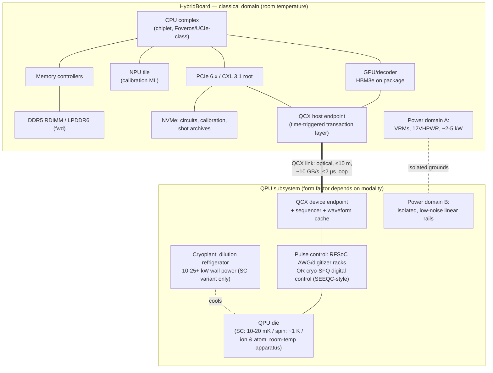

# HybridBoard Architecture — v0.1

**Document:** HYBRIDBOARD-ARCH-v0.1.md
**Series:** Advance Labs Quantum/Classical Hybrid Research — `hybrid-board/` tree
**Date:** June 2026
**Status:** design concept — not a product specification
**Source of truth:** [docs/research/03-hybrid-board.md](../../docs/research/03-hybrid-board.md) (the feasibility study); process defined in [docs/workflows/03-hybridboard-workflow.md](../../docs/workflows/03-hybridboard-workflow.md) (Stage 1). Every latency, bandwidth, power, and TRL figure in this document is imported from the research doc and carries its original claim tag. No tag has been promoted.

---

## 1. Scope and Variants

This is the canonical architecture document for **HybridBoard**: a chiplet-based classical compute complex coupled to a QPU subsystem over the theoretical **QCX (Quantum Compute Express)** interconnect (specified separately in [QCX-PROTOCOL-v0.1.md](QCX-PROTOCOL-v0.1.md)). The binding design facts, restated from the research doc and kept in view throughout:

- The constraint is **latency, not bandwidth**: the QCX control loop must close in **≤2 µs** against superconducting T1 ≈ 160–350 µs **[Demonstrated]** (research doc §4.1).
- For superconducting QPUs, **the "board" is a room** — a shielded installation with a 10–25+ kW cryoplant **[Demonstrated]** (research doc §7.1).
- **Quantum registers can never appear in the classical address space** — a direct consequence of the no-cloning theorem and measurement collapse **[Proven]** (research doc §5.2; Wootters & Zurek 1982).

### 1.1 Variant naming and provenance

| Variant | Form factor | Qubit modality | Naming provenance | Tag |
|---|---|---|---|---|
| **HybridBoard-SC** | HPC *row*: cryostat island + control rack + classical rack | Superconducting transmon (10–20 mK) | **Named in the research doc** (§7.1: "HybridBoard-SC is therefore a *row*") | **[Theoretical]** (architecture); cryogenic constraints **[Demonstrated]** |
| **HybridBoard-RT** | Rack backplane: classical host and QPU controller share a chassis | Neutral atom / trapped ion (room-temperature apparatus) | **Coined by this workflow** (03-hybridboard-workflow.md, Stage 1, step 1) for the room-temperature rack-backplane concept the research doc describes but does not name (§7.2, §9.2) | **[Theoretical]** (integration); rack appliances **[Demonstrated]** |
| **HybridBoard-Spin** | Literal motherboard: sealed 1 K closed-cycle cryo-module on the board edge | Silicon spin qubits (~0.1–1+ K) | **Coined by this workflow** (03-hybridboard-workflow.md, Stage 1, step 1) for the board-edge cryo-module concept the research doc describes but does not name (§7.2) | **[Speculative]** — physics permits (≥1 K operation **[Demonstrated]**), no module engineering exists |

HybridBoard-SC is the only variant named in the research doc itself. The `-RT` and `-Spin` names are workflow-level labels introduced so later stages can reference the three concepts unambiguously; they add no technical content beyond the research doc's §7.1, §7.2, and §9.2.

---

## 2. Block Diagram

The diagram below reproduces the research doc §10 block diagram — same node set, no nodes removed or renamed — with the QCX link edge carrying the same figures: **optical, ≤10 m, ~10 GB/s, ≤2 µs loop**. The QCX transaction layer is **[Theoretical]**; the classical-domain blocks are built from **[Demonstrated]** parts (see §4 component table).

### 2.1 Mermaid



Domain boundaries (per research doc §10): everything left of the QCX link is ordinary classical engineering; everything right of it is modality-specific. For HybridBoard-Spin, QSUB collapses into a board-edge cryo-module; for HybridBoard-SC, QSUB is a shielded room.

### 2.2 ASCII fallback

```
+=====================================================================+
| HybridBoard — classical domain (room temperature)        [BOARD]   |
|                                                                     |
|  +----------------+   +-------------------+   +------------------+ |
|  | CPU complex    |---| Memory controllers|---| DDR5 RDIMM /     | |
|  | (chiplet,      |   |       [MC]        |   | LPDDR6 (fwd)     | |
|  |  Foveros/UCIe) |   +-------------------+   |      [DDR]       | |
|  |     [CPU]      |                           +------------------+ |
|  +---+---+----+---+                                                |
|      |   |    |                                                    |
|      |   |    +-----------------------+                            |
|      |   |                            |                            |
|  +---+---+--------+   +---------------+--+   +------------------+  |
|  | GPU/decoder    |   | NPU tile         |   | NVMe: circuits,  |  |
|  | HBM3e on pkg   |   | (calibration ML) |   | calibration,     |  |
|  |     [GPU]      |   |      [NPU]       |   | shot archives    |  |
|  +-------+--------+   +------------------+   |     [NVME]       |  |
|          |                                   +--------+---------+  |
|          |     +------------------------+             |            |
|          |     | PCIe 6.x / CXL 3.1 root|-------------+            |
|          |     |        [PCIE]          |                          |
|          |     +-----------+------------+                          |
|          |                 |                                       |
|  +-------+-----------------+--------+   +-----------------------+  |
|  | QCX host endpoint                |   | Power domain A:       |  |
|  | (time-triggered transaction lyr) |   | VRMs, 12VHPWR,        |  |
|  |            [QCXH]                |   | ~2-5 kW    [PWR1]     |  |
|  +----------------+-----------------+   +-----------+-----------+  |
+===================|=================================|==============+
                    |  QCX link: optical, <=10 m,     :  isolated
                    |  ~10 GB/s, <=2 us loop          :  grounds
+===================|=================================|==============+
| QPU subsystem (form factor depends on modality)  [QSUB]            |
|  +----------------+-----------------+   +-----------+-----------+  |
|  | QCX device endpoint              |   | Power domain B:       |  |
|  | + sequencer + waveform cache     |   | isolated, low-noise   |  |
|  |            [QCXD]                |   | linear rails  [PWR2]  |  |
|  +----------------+-----------------+   +-----------------------+  |
|                   |                                                |
|  +----------------+-----------------+                              |
|  | Pulse control: RFSoC AWG/dig.    |                              |
|  | racks OR cryo-SFQ digital ctrl   |                              |
|  | (SEEQC-style)      [CTRL]        |                              |
|  +----------------+-----------------+                              |
|                   |                                                |
|  +----------------+-----------------+   +-----------------------+  |
|  | QPU die                          |...| Cryoplant: dilution   |  |
|  | (SC: 10-20 mK / spin: ~1 K /     |cools refrigerator 10-25+  |  |
|  |  ion & atom: room-temp apparatus)|   | kW wall (SC only)     |  |
|  |            [QPU]                 |   |        [CRYO]         |  |
|  +----------------------------------+   +-----------------------+  |
+=====================================================================+
```

---

## 3. Per-Variant Physical Topology

### 3.1 HybridBoard-SC — the "board" is a row **[Theoretical]** (constraints **[Demonstrated]**)

Per research doc §7.1, a 20 mK cryostat is physically incompatible with co-location on a literal motherboard:

- **Scale:** IBM Quantum System Two measures roughly 22 feet wide by 12 feet high **[Demonstrated]**. The QPU die is centimeters; its life-support is architectural.
- **Vibration:** pulse-tube cryocoolers impose ~1–2 Hz mechanical cycling; qubit packages require isolation from exactly the rotating machinery (fans, pumps, compressors) that classical kW-class cooling relies on. Engineering separation of meters with isolated mounting is the demonstrated practice **[Demonstrated]**.
- **EMI:** transmon transition frequencies sit at 4–6 GHz — squarely amid classical clock harmonics, DDR5 signaling, and switching-regulator noise. Minimum practical posture: classical complex in an adjacent shielded rack, QCX crossing the boundary on optical fiber **[Theoretical]**.

**Topology:** cryostat island (3 m × 3 m × 3 m, seismic-isolated slab) + control rack + classical rack, joined by **≤10 m optical QCX links (~50 ns fiber delay — within the §4.1 latency budget)**. **[Theoretical]**

```
[classical rack]--QCX optical <=10 m-->[control rack]--coax/SFQ-->[cryostat island 3x3x3 m]
  (BOARD nodes)                          (QCXD, CTRL)               (QPU, CRYO, PWR2)
```

### 3.2 HybridBoard-RT — shared chassis/backplane **[Theoretical]**

The neutral-atom / trapped-ion QPU is already a rack appliance (~3 kW, standard data-center install) **[Demonstrated]** (research doc §7.2). "HybridBoard" here means a backplane-level integration: classical host and QPU controller share a chassis, with conventional forced-air/liquid cooling, provided laser and optics modules get vibration-damped mounts **[Theoretical]**. The QCX link is intra-chassis (electrical or short optical); the ≤10 m optical reach is an upper bound, not a requirement.

### 3.3 HybridBoard-Spin — board-edge cryo-module **[Speculative]**

Per research doc §7.2: 1 K is reachable with compact closed-cycle coolers far smaller than dilution refrigerators, and 1 K stages offer orders of magnitude more cooling power than 20 mK stages **[Demonstrated]** (operating regime). A **sealed cryo-module of small-refrigerator size hosting a spin-qubit die + cryo-CMOS control, mounted on the board edge like a power supply**, is the most credible literal interpretation of a "quantum motherboard" — **[Speculative]**. The real blocker is the qubit-count and fidelity gap (12-qubit arrays today **[Demonstrated]**), not the thermals. This is the only variant in which QSUB and BOARD share a literal PCB.

---

## 4. Component Selection Table

Transcribed in substance from research doc §11 rows 1–16, with three added columns: candidate part number(s), interface, and status. Statuses match the research doc §11 "Real or theoretical?" column exactly.

| # | Block | Specified part / basis (research doc §11) | Candidate part number(s) | Interface | Real or theoretical? |
|---|---|---|---|---|---|
| 1 | CPU complex | Chiplet CPU with Foveros/UCIe-class packaging (Meteor-Lake-pattern tiles) | Intel Core Ultra (Meteor Lake pattern: Compute/Graphics/SoC-NPU/IO tiles on Foveros base) — specific SKU open | UCIe/Foveros die-to-die; DDR5 MC; PCIe 6.x root | **Real** (pattern) — specific SKU open |
| 2 | GPU / QEC decoder | AMD MI300X-class (192 GB HBM3, 5.3 TB/s) or NVIDIA Blackwell/Rubin (NVLink 5/6: 1.8/3.6 TB/s) | AMD Instinct MI300X; NVIDIA B200 (Blackwell) / Rubin-class | PCIe 6.x / CXL 3.1; Infinity Fabric or NVLink 5/6 | **Real** |
| 3 | NPU | Integrated NPU tile (Meteor Lake SoC-tile pattern) for calibration/drift ML | Intel NPU (Meteor Lake SoC tile) | On-package (Foveros/UCIe) | **Real** (part) — role theoretical |
| 4 | System memory | DDR5 RDIMM; LPDDR6 (JESD209-6) forward option; **DDR6 excluded — not ratified as of June 2026** | DDR5-5600 RDIMM (JEDEC); LPDDR6 per JESD209-6 (published July 2025, 10,667–14,400 MT/s) — *forward option only* | DDR5 channels; LPDDR6 (fwd) | **Real** |
| 5 | Storage | NVMe SSD (circuit/calibration/shot store) | Any enterprise NVMe Gen5 SSD | PCIe 5.0/6.x x4 | **Real** |
| 6 | Host I/O | PCIe 6.x + CXL 3.1, 64 GT/s, latency-optimized flits | CXL 3.1 root complex; Microchip XpressConnect PCIe 6.0 / CXL 3.1 retimers (<12 ns pin-to-pin) | PCIe 6.x PHY, 256 B latency-optimized flit | **Real** (spec/early silicon) |
| 7 | QCX host + device endpoints | CXL 3.1 PHY + custom time-triggered transaction layer (research doc §4.3; spec: [QCX-PROTOCOL-v0.1.md](QCX-PROTOCOL-v0.1.md)) | — none exists — | CXL 3.1 PHY/link; QCX transaction layer | **Theoretical** |
| 8 | QPU pulse control | RFSoC-class AWG/digitizers (4–6.5 GS/s converters; QICK/QubiC lineage) or Quantum Machines OPX-class (DGX Quantum pairing) | AMD/Xilinx Zynq UltraScale+ RFSoC Gen3 (DAC up to 6.554 GS/s, ADC 4.096 GS/s); Quantum Machines OPX1000-class | JESD/analog front end; QCX device side | **Real** |
| 9 | Cryo-digital control option | SEEQC SFQ control at mK, >99.5% fidelity, Nature Electronics 2026 | SEEQC SFQ co-fabricated control chip | In-cryostat SFQ digital | **Real** (5-qubit demo) — scale theoretical |
| 10 | QPU (superconducting) | IBM Heron/Nighthawk-class (120–156 q) or Google Willow-class (105 q) | IBM Heron (133/156 q) / Nighthawk (120 q); Google Willow (105 q) | Microwave lines or SFQ (row 9) | **Real** — not merchant silicon (cannot be purchased as a component) |
| 11 | QPU (trapped ion) | IonQ Forte Enterprise (36 AQ, rack); Quantinuum Helios (98 q) | IonQ Forte Enterprise; Quantinuum Helios | Vendor system interface (rack appliance) | **Real** (system-level only) |
| 12 | QPU (neutral atom) | Pasqal Orion-class rack, ~3 kW; QuEra logical-qubit architecture | Pasqal Orion | Vendor system interface (rack appliance) | **Real** (system-level only) |
| 13 | QPU (spin, board-attach cryo-module) | Tunnel-Falls-lineage 300 mm die + Diraq ≥1 K operation in closed-cycle cooler | Intel Tunnel Falls lineage (12-qubit, 300 mm, 95% yield) — *module does not exist* | Sealed cryo-module on board edge (HybridBoard-Spin) | **Theoretical** (module); dies real at 12-qubit scale |
| 14 | Cryoplant | Bluefors-class dilution refrigerator, ~10–25 kW wall | Bluefors LD-class | Facility (SC variant only) | **Real** |
| 15 | Power subsystem | Dual-domain: switching VRMs (classical) + isolated low-noise rails (quantum control) | Commodity VRM/12VHPWR (domain A); isolated linear supplies (domain B) | Isolated grounds between domains A/B | **Real** parts / **theoretical** integration |
| 16 | Firmware/OS | UEFI QPU DXE driver, ACPI QDEV object, Linux `qcx` bus driver (research doc §8) | — none exists — | UEFI DXE / ACPI namespace / Linux platform bus | **Theoretical** |

> **Note (row 4):** **DDR6 is excluded — not ratified as of June 2026.** JEDEC ratification has slipped into 2026; first hardware expected late 2026, broad adoption 2027. The only finalized DDR6-era standard is LPDDR6 (JESD209-6, published July 2025), which this design lists strictly as a forward option **[Demonstrated]** (spec status, research doc §5.1).

---

## 5. Memory Architecture

Restated from research doc §5.2. HybridBoard exposes a single classical physical address space (UMA-style, per the Apple M-series precedent **[Demonstrated]**) containing exactly four QPU-related mappable regions:

| Region | Backing | Contents |
|---|---|---|
| QCX MMIO window | QPU-side control registers | sequencer config, timing epoch, error counters |
| Syndrome/result ring buffers | host DRAM, DMA-written by QCX endpoint | measurement bitstreams, timestamps |
| Waveform/calibration store | host DRAM/NVMe, bulk channel | pulse tables, per-qubit calibration constants |
| Circuit object store | NVMe | QASM/QIR circuit descriptions, transpiled binaries |

> ### Quantum registers do not appear in this address space. **[Proven]**
>
> This is not an engineering limitation but a physical one:
>
> - **No-cloning theorem:** an unknown quantum state cannot be copied — linearity of quantum mechanics forbids it **[Proven]** (Wootters & Zurek, *Nature* 299, 802 (1982)). There is no quantum analog of a DMA read, checkpoint, or swap-out: any "read" is a measurement.
> - **Measurement collapse:** reading n qubits yields n classical bits and destroys the superposition; the 2ⁿ complex amplitudes are not recoverable from any single shot **[Proven]**. (Holevo's bound formalizes that n qubits cannot convey more than n classical bits of accessible information.)
> - Consequently a "suspend-to-disk" of quantum state is physically impossible, and quantum memory cannot be virtualized, paged, or mirrored. **[Proven]**

**What CAN be persisted** — the durable representation of "quantum state" for firmware purposes (research doc §5.2):

1. **Circuit descriptions** (OpenQASM/QIR) — the *program*, O(g) bytes for g gates.
2. **Calibration data** — per-qubit frequencies, pulse amplitudes, crosstalk matrices; O(n²) worst case for n qubits.
3. **Measurement results** — shot tables, syndrome streams, expectation-value estimates; O(shots × n) bits.
4. **Random seeds and transpilation artifacts** — sufficient to *re-execute*, which is the only legitimate notion of "restoring" a quantum computation.

Decoder working sets (surface-code decoding state, syndrome history ring buffers, ML-decoder weights) live in HBM3/HBM3e on the GPU package (MI300X-class: 192 GB HBM3 at 5.3 TB/s **[Demonstrated]**, research doc §5.1).

---

## 6. Power and Thermal Summary

### 6.1 Superconducting variant (HybridBoard-SC) — research doc §6 table, reproduced exactly

Verified anchor points: lab-scale dilution refrigerators draw ~5–10 kW wall power, large systems up to ~25–26 kW, with pulse-tube coolers dominating at ~10–15 kW (wall-to-cold efficiency ~1:1500) **[Demonstrated]**; a RAND analysis extrapolates ~6 W per physical qubit all-in for a future large superconducting machine **[Theoretical]**.

| Subsystem | 50 physical qubits | 500 physical qubits | 5,000 physical qubits | Tag |
|---|---|---|---|---|
| Dilution refrigerator (pulse tubes, compressors, pumps) | 10–15 kW (1 small cryostat) | 20–30 kW (1 large cryostat) | 50–100 kW (multi-cryostat / System-Two-class plant) | **[Demonstrated]** (50/500 anchors) / **[Speculative]** (5,000) |
| QPU control electronics (room-temp RFSoC/sequencers, ~2–4 ch/qubit) | 2–5 kW | 15–40 kW | 100–250 kW (or far less with cryo-SFQ control **[Speculative]**) | **[Demonstrated]** (per-channel anchors) / **[Theoretical]** (scaling) |
| Classical complex (CPU + 1× GPU + NPU + DRAM + NVMe) | 1.5–2.5 kW | 2.5–5 kW (decoder GPUs added) | 10–30 kW (decoder cluster) | **[Demonstrated]** (component TDPs) |
| Power conversion / distribution losses (~10%) | ~1.5–2 kW | ~4–7 kW | ~15–40 kW | **[Theoretical]** |
| **Total "board" (really: installation) TDP** | **≈ 15–25 kW** | **≈ 40–80 kW** | **≈ 175 kW–0.4 MW** | **[Speculative]** at 5,000 q |
| Cross-check vs ~6 W/qubit all-in | 0.3 kW/qubit ≈ small-system overhead dominates | ~0.1 kW/qubit | converging toward ~0.04–0.08 kW/qubit | **[Theoretical]** |

The cryoplant draw is **independent of workload mix**: the dilution refrigerator runs at full load regardless of utilization (wall-to-cold efficiency ~1:1500 **[Demonstrated]**). The Stage 5 power model (`hybrid-board/scheduler/power_model.py`) must reproduce these totals and demonstrate that invariance.

### 6.2 Room-temperature contrast (HybridBoard-RT)

A neutral-atom QPU subsystem at ~3 kW **[Demonstrated]** plus a 2 kW classical complex yields a **~5–6 kW total** — a high-end server rack budget, not a facility budget (research doc §6).

### 6.3 Thermal design constraints by variant

| Variant | Cooling posture | Key constraints | Tag |
|---|---|---|---|
| HybridBoard-SC | Cryostat island, seismic-isolated, meters of separation from classical racks | Vibration (1–2 Hz pulse-tube cycling), EMI at 4–6 GHz transmon frequencies, mu-metal/superconducting shielding; QCX crosses the boundary on optical fiber | **[Demonstrated]** (constraints) / **[Theoretical]** (QCX posture) |
| HybridBoard-RT | Conventional forced-air/liquid, shared chassis | Vibration-damped mounts for laser/optics modules | **[Theoretical]** (integration); ~3 kW appliance **[Demonstrated]** |
| HybridBoard-Spin | Sealed closed-cycle 1 K cryo-module on board edge | 1 K stages have ~100–1000× the cooling power of 20 mK stages **[Demonstrated]**; module engineering does not exist | **[Speculative]** |

---

## 7. Cross-References

- QCX transaction layer, flit format, latency SLAs, arbitration, error handling: [QCX-PROTOCOL-v0.1.md](QCX-PROTOCOL-v0.1.md) (Stage 2).
- UEFI POST / ACPI `QDEV` enumeration: `hybrid-board/firmware/QPUINIT.md`, `hybrid-board/firmware/ACPI-QDEV.md` (Stage 3, forthcoming).
- Scheduler reference model and power model: `hybrid-board/scheduler/` (Stages 4–5, forthcoming).
- TRL assessment for every block above: research doc §12 — QCX bus TRL 2; QDEV attach model TRL 2; board-edge spin cryo-module TRL 2; integrated HybridBoard product TRL 2–3.
