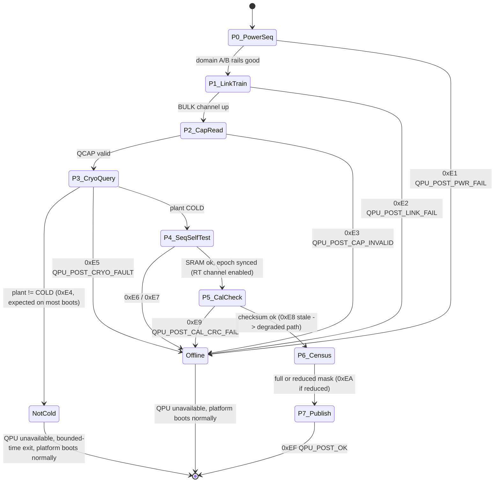

# QPUINIT — QPU UEFI Initialization and Power-On Self Test (POST) Sequence

**Document:** `hybrid-board/firmware/QPUINIT.md`
**Series:** Advance Labs Quantum/Classical Hybrid Research — HybridBoard, Stage 3 (Firmware / UEFI Extension)
**Version:** v0.1
**Status:** design concept — not a product specification
**TRL:** 2 — paper design only. No shipping platform exposes a QPU through UEFI/ACPI today.

> **Blanket tag (per research doc §8):** every design element in this document is
> **[Theoretical]**. Precedents cited from the research doc are real and carry their
> own tags. Sources of truth: [docs/research/03-hybrid-board.md](../../docs/research/03-hybrid-board.md)
> (§4 QCX, §5.2 memory regions, §7 thermal, §8.1 UEFI extensions) and
> [docs/workflows/03-hybridboard-workflow.md](../../docs/workflows/03-hybridboard-workflow.md) (Stage 3).
> Flit and channel semantics are defined in
> [QCX-PROTOCOL-v0.1.md](../architecture/QCX-PROTOCOL-v0.1.md) and are not redefined here.

---

## 1. Scope

This document specifies the UEFI boot-time integration of a QCX-attached QPU:

1. The **QPU DXE driver** (`QpuDxe`) and the `EFI_QPU_PROTOCOL` it publishes (research doc §8.1).
2. The **Quantum Capability Structure (QCAP)** the driver reads from the QCX endpoint.
3. The **POST sequence** as a numbered state machine, including the cryo handshake and
   the `QPU_NOT_COLD` path that is the *expected* outcome on most boots of the
   superconducting variant.
4. **POST codes and failure modes**, none of which are fatal to platform boot.
5. How each phase differs across the **HybridBoard-SC / -RT / -Spin** variants.

ACPI enumeration (the `QDEV` object) and the OS driver model are specified in
[ACPI-QDEV.md](ACPI-QDEV.md).

---

## 2. UEFI Driver Architecture

### 2.1 QPU DXE driver

Per research doc §8.1, `QpuDxe` is a DXE driver that:

1. Enumerates the **QCX endpoint** during the DXE phase, using the QCX **BULK channel
   only** (ordinary CXL.io semantics). The RT channel is never used by firmware before
   timestamp-epoch synchronization (Phase P4 below) — an unsynchronized time-triggered
   channel has no meaningful `t_exec` reference.
2. Reads the **Quantum Capability Structure** (qubit count, topology, modality,
   calibration-store pointer — §2.3).
3. Publishes an **`EFI_QPU_PROTOCOL`** (analogous to existing UEFI device protocols),
   if and only if POST reaches the publication phase (P7).
4. Synthesizes/patches the SSDT containing the `QDEV` ACPI node so OSPM can enumerate
   the device after `ExitBootServices` (see [ACPI-QDEV.md](ACPI-QDEV.md) §6).

### 2.2 Protocol GUID and interface sketch

GUID values below are illustrative placeholders for a v0.1 paper design; a real
implementation would register a fresh GUID.

```c
/*
 * EFI_QPU_PROTOCOL — paper design, TRL 2. No hardware exists; this sketch
 * exists so the attach model is specified before the hardware needs it
 * (research doc §13: "a standards effort (QCX, QDEV)").
 */
#define EFI_QPU_PROTOCOL_GUID \
  { 0x51435830, 0x0001, 0x0010, \
    { 0x48, 0x59, 0x42, 0x52, 0x44, 0x42, 0x44, 0x30 } }   /* "QCX0"..."HYBRDBD0" */

typedef struct _EFI_QPU_PROTOCOL EFI_QPU_PROTOCOL;

typedef enum {
  QpuAvailabilityOffline    = 0,  /* POST failed; see PostCode            */
  QpuAvailabilityNotCold    = 1,  /* cryoplant not at base temperature    */
  QpuAvailabilityCalibrating= 2,  /* cold; calibration stale or running   */
  QpuAvailabilityDegraded   = 3,  /* online with a partial qubit mask     */
  QpuAvailabilityOnline     = 4
} QPU_AVAILABILITY;

typedef EFI_STATUS (EFIAPI *EFI_QPU_GET_CAPABILITY)(
  IN  EFI_QPU_PROTOCOL        *This,
  OUT QPU_CAPABILITY_STRUCTURE *Cap            /* §2.3 layout */
  );

typedef EFI_STATUS (EFIAPI *EFI_QPU_GET_AVAILABILITY)(
  IN  EFI_QPU_PROTOCOL  *This,
  OUT QPU_AVAILABILITY  *Availability,
  OUT UINT8             *PostCode              /* §5 table    */
  );

typedef EFI_STATUS (EFIAPI *EFI_QPU_READ_CAL_STORE)(
  IN  EFI_QPU_PROTOCOL  *This,
  IN  UINT64             Offset,
  IN OUT UINTN          *Length,
  OUT VOID              *Buffer                /* BULK channel read of NV store */
  );

struct _EFI_QPU_PROTOCOL {
  UINT32                    Revision;          /* 0x00000010 = v0.1 */
  EFI_QPU_GET_CAPABILITY    GetCapability;
  EFI_QPU_GET_AVAILABILITY  GetAvailability;
  EFI_QPU_READ_CAL_STORE    ReadCalStore;
};
```

### 2.3 Quantum Capability Structure (QCAP)

Read in POST phase P2 over the BULK channel from the QCX endpoint's capability region.
Field widths are chosen for consistency with the QCX flit header
(`vqid[16]` — virtual qubit IDs are 16-bit; see
[QCX-PROTOCOL-v0.1.md](../architecture/QCX-PROTOCOL-v0.1.md)).

| Offset | Size | Field | Description |
|---|---|---|---|
| 0x00 | 4 B | `Signature` | ASCII `QCAP` |
| 0x04 | 2 B | `Version` | 0x0001 for this layout |
| 0x06 | 2 B | `Length` | total structure length in bytes |
| 0x08 | 2 B | `QubitCount` | physical qubit count *n* (u16, matches `vqid[16]` width) |
| 0x0A | 1 B | `Modality` | code per table below |
| 0x0B | 1 B | `TopologyClass` | 0 = heavy-hex, 1 = square lattice, 2 = all-to-all, 3 = arbitrary edge list |
| 0x0C | 4 B | `TopologyOffset` | offset of the coupling-map blob in the capability region |
| 0x10 | 4 B | `TopologyLength` | coupling-map blob length in bytes |
| 0x14 | 8 B | `CalStorePointer` | calibration-store pointer: BULK-channel base address of the non-volatile calibration store (research doc §8.1) |
| 0x1C | 4 B | `Flags` | bit 0: cryoplant present; bit 1: cryo-SFQ control; bit 2: laser/UHV interlock present; bits 3–31 reserved |

**Modality codes** (shared verbatim with the `QTOP` blob in
[ACPI-QDEV.md](ACPI-QDEV.md) §4 — the two tables MUST NOT diverge):

| Code | Modality (research doc §3.1) |
|---|---|
| 0 | Superconducting transmon |
| 1 | Trapped ion |
| 2 | Photonic |
| 3 | Neutral atom |
| 4 | Silicon spin |

---

## 3. POST Sequence

The POST sequence is a numbered state machine. Phases **P1–P3, P7** map one-to-one onto
the workflow Stage 3 canonical six-step machine (steps 1–3 and 6); phases **P4–P6**
elaborate steps 4–5 and add a qubit functional census on the cold path. Phase P0 is
platform power sequencing that precedes DXE.

**Cold-path gating rule:** phases P4–P7 run **only if** the cryoplant reports `COLD`
(workflow Stage 3, step 2). On any other plant state the machine exits at P3 with
status `QPU_NOT_COLD` — the expected outcome on most boots, since cooldown from room
temperature is **hours–days** for dilution systems **[Demonstrated]** (research doc §8.1, [41]).

### P0 — Power sequencing (pre-DXE)

- Platform power sequencer brings up **power domain A** (classical complex: switching
  VRMs, ~2–5 kW — research doc §10) and then **power domain B** (QPU control: isolated,
  low-noise linear rails with isolated grounds — research doc §10). Domain B rails feed
  the QCX device endpoint, sequencer, and control electronics — **not** the cryoplant,
  which is facility power outside board POST scope (10–25+ kW wall for dilution
  refrigerators **[Demonstrated]** [41]).
- Failure: `QPU_POST_PWR_FAIL` (0xE1). QPU marked offline; platform boot continues.

### P1 — QCX link training *(workflow step 1)*

- CXL PHY bring-up of the QCX link; **BULK channel only**. The link layer is the
  CXL 3.1 256 B latency-optimized flit **[Demonstrated]** (research doc §4.3, [18]);
  the time-triggered RT channel stays administratively down until P4 epoch sync.
- Failure: `QPU_POST_LINK_FAIL` (0xE2).

### P2 — Capability structure read *(workflow step 2)*

- Read and validate QCAP (§2.3): signature, version, length, qubit count > 0,
  modality code known, topology blob bounds sane, calibration-store pointer non-null.
- Failure: `QPU_POST_CAP_INVALID` (0xE3).

### P3 — Cryo handshake / interlock query *(workflow step 3)*

- Query the cryoplant (or modality-equivalent interlock — §6) state machine:
  `WARM / COOLING / COLD / REGEN` (the same four states surfaced to OSPM via `QTHM`;
  see [ACPI-QDEV.md](ACPI-QDEV.md) §3).
- **Expected result on most boots: not `COLD`** → record `QPU_NOT_COLD` (0xE4),
  mark the QPU unavailable, and exit POST in bounded time. This is a *status*,
  not a fault; it may persist across many OS boots (research doc §8.1).
- A hard interlock fault (e.g., plant controller unreachable, safety interlock open)
  is `QPU_POST_CRYO_FAULT` (0xE5).

### P4 — Control-electronics bring-up and sequencer self-test *(workflow step 4; cold path only)*

- Bring up the pulse-control electronics behind the QCX device endpoint (RFSoC-class
  AWG/digitizers or SEEQC-style cryo-SFQ digital control — research doc §10, [28][35]).
- **Waveform-cache SRAM check**: pattern test of the sequencer's local waveform cache
  (the cache that makes ~10 GB/s sustained host bandwidth sufficient instead of
  0.2–20 TB/s raw streaming — research doc §4.2).
- **Timestamp-epoch sync via SYNC flits**: establish the global QCX epoch
  (`t_exec[64]`, ps resolution) between host and device endpoints; only after a
  successful sync is the RT channel enabled.
- Failures: `QPU_POST_SEQ_FAIL` (0xE6) for SRAM; `QPU_POST_EPOCH_DRIFT` (0xE7) if
  residual offset exceeds tolerance — the RT channel stays disabled in that case,
  because time-triggered delivery without a trusted epoch is meaningless.

### P5 — Calibration data load and integrity check *(workflow step 5; cold path only)*

- Load per-qubit calibration constants (frequencies, pulse amplitudes, crosstalk
  matrices — O(n²) worst case, research doc §5.2) from the non-volatile calibration
  store over the BULK channel and verify the checksum.
- Failures: `QPU_POST_CAL_CRC_FAIL` (0xE9) — unavailable until recalibration;
  `QPU_POST_CAL_STALE` (0xE8) — constants older than their validity window:
  the QPU is published *degraded/calibrating*, not offline.

### P6 — Qubit functional census *(cold path only)*

- A POST-level smoke test, **not** a full calibration run: for each qubit in the QTOP
  map, one initialize–readout cycle (and, per modality, a trap/load occupancy check —
  §6) to build the **functional qubit mask** published with the protocol. Coherence
  anchors for the SC variant: T1 ≈ 160–350 µs **[Demonstrated]** (research doc §4.1, [3][31]).
- Partial failure: `QPU_POST_CENSUS_DEGRADED` (0xEA) — publish with a reduced mask.
  Census never fails the platform; a fully dead census reports the QPU offline.

### P7 — Publish protocol with availability status *(workflow step 6)*

- Install `EFI_QPU_PROTOCOL` with availability `Online`, `Degraded`, or
  `Calibrating` plus the final POST code, and finalize the `QDEV` SSDT objects.
- Success: `QPU_POST_OK` (0xEF).

### State machine diagram



---

## 4. Boot Policy (Normative)

Normative-language convention (MUST/SHOULD/MAY) per
[QCX-PROTOCOL-v0.1.md](../architecture/QCX-PROTOCOL-v0.1.md).

1. The QPU is **never** on the boot-critical path. Platform boot MUST NOT block on,
   or fail because of, any QPU POST outcome. (Research doc §8.1.)
2. The QPU is a **late-attach device**. The `QPU_NOT_COLD` status MAY persist across
   many OS boots; firmware MUST treat this as normal, not as an error to retry.
3. POST MUST complete — with the QPU marked unavailable if necessary — in **bounded
   time regardless of cryoplant state**. Illustrative per-phase timeouts (v0.1,
   non-binding): P1 ≤ 500 ms, P2 ≤ 100 ms, P3 ≤ 250 ms, P4 ≤ 2 s, P5 ≤ 2 s,
   P6 ≤ 5 s; each phase MUST have *a* finite timeout.
4. Firmware MUST NOT attempt to drive the cryoplant toward `COLD` (no implicit
   cooldown commands); plant state transitions are facility/operator actions surfaced
   read-only through `QTHM` (see [ACPI-QDEV.md](ACPI-QDEV.md) §3, §5).
5. Firmware MUST NOT persist, snapshot, or claim to restore any quantum state. The
   only durable artifacts are circuit descriptions, calibration data, measurement
   results, and seeds/transpilation artifacts (research doc §5.2) — restoring a
   quantum computation means re-execution, never state restore. **[Proven]**
   (no-cloning, Wootters & Zurek 1982 [40]; measurement collapse).
6. The RT channel MUST remain disabled until timestamp-epoch sync succeeds (P4), and
   MUST NOT be used by firmware for anything other than SYNC traffic and self-test.

---

## 5. POST Codes and Failure Modes

POST codes occupy an illustrative vendor checkpoint window (0xE0–0xEF). The defining
invariant, stated normatively: **no QPU POST code is fatal to platform boot.**

| POST code | Mnemonic | Phase | Failure mode | Effect on QPU availability | Effect on platform |
|---|---|---|---|---|---|
| 0xE0 | `QPU_POST_START` | P0 | — (checkpoint) | — | none |
| 0xE1 | `QPU_POST_PWR_FAIL` | P0 | power-domain-B rail fault / sequencer aux power missing | Offline | none |
| 0xE2 | `QPU_POST_LINK_FAIL` | P1 | QCX link training failure (PHY, BULK channel) | Offline | none |
| 0xE3 | `QPU_POST_CAP_INVALID` | P2 | QCAP signature/version/bounds invalid | Offline | none |
| 0xE4 | `QPU_NOT_COLD` | P3 | cryoplant in WARM / COOLING / REGEN — **status, not fault**; expected on most boots (cooldown hours–days **[Demonstrated]** [41]) | NotCold (late attach) | none |
| 0xE5 | `QPU_POST_CRYO_FAULT` | P3 | plant controller unreachable or safety interlock open | Offline | none |
| 0xE6 | `QPU_POST_SEQ_FAIL` | P4 | waveform-cache SRAM test failure | Offline | none |
| 0xE7 | `QPU_POST_EPOCH_DRIFT` | P4 | timestamp-epoch sync residual beyond tolerance; RT channel kept disabled | Offline (RT-incapable) | none |
| 0xE8 | `QPU_POST_CAL_STALE` | P5 | calibration constants older than validity window | Calibrating/Degraded | none |
| 0xE9 | `QPU_POST_CAL_CRC_FAIL` | P5 | calibration-store checksum mismatch | Offline until recalibration | none |
| 0xEA | `QPU_POST_CENSUS_DEGRADED` | P6 | subset of qubits fail functional census | Degraded (reduced qubit mask) | none |
| 0xEF | `QPU_POST_OK` | P7 | — | Online | none |

Fatality summary: 0xE1–0xE3, 0xE5–0xE7, 0xE9 are fatal to **QPU availability** for the
current boot; 0xE4, 0xE8, 0xEA are non-fatal availability qualifiers; **none** is fatal
to the platform.

---

## 6. Variant Differences: HybridBoard-SC / -RT / -Spin

Variant names follow the workflow Stage 1 definitions: **HybridBoard-SC** (HPC row,
superconducting — the "board" is a room, research doc §7.1), **HybridBoard-RT** (rack
backplane, neutral atom / trapped ion, research doc §7.2/§9.2), **HybridBoard-Spin**
(board-edge 1 K cryo-module, **[Speculative]**, research doc §7.2).

| Phase | HybridBoard-SC | HybridBoard-RT | HybridBoard-Spin |
|---|---|---|---|
| P0 Power sequencing | Domain B linear rails feed control rack; cryoplant (10–25+ kW wall **[Demonstrated]** [41]) is facility power, outside POST | Single-chassis PSU; QPU appliance class ~3 kW (Pasqal Orion anchor **[Demonstrated]** [12]) | Cryocooler rail on board edge, PSU-like module **[Speculative]** |
| P1 QCX link training | Optical QCX, ≤10 m, ~50 ns fiber delay (research doc §7.1) **[Theoretical]** | Backplane copper within shared chassis **[Theoretical]** | On-board short-reach link to the cryo-module **[Speculative]** |
| P3 Cryo handshake / interlock | Dilution-refrigerator state machine; cooldown **hours–days [Demonstrated]** [41]; `QPU_NOT_COLD` is the common case across many boots | **No cryoplant.** Phase becomes a laser/UHV interlock readiness check (vacuum cell, laser racks — room-temperature apparatus **[Demonstrated]** [7][12]); typically ready within a boot session | Compact closed-cycle cooler to ~1 K — far smaller plant; 1 K stages have ~100–1000× the cooling power of 20 mK stages **[Demonstrated]** (operating regime [24]); cooldown far shorter than dilution systems, module engineering unbuilt **[Speculative]** |
| P4 Control-electronics bring-up | RFSoC AWG/digitizer racks (4–6.5 GS/s converters **[Demonstrated]** [35][37]) or cryo-SFQ digital control (SEEQC-style, >99.5% fidelity at 5-qubit scale **[Demonstrated]** [28][29]) | Laser/modulator and AOD driver bring-up; electronic (laser-free) ion control is prototype-stage **[Demonstrated]** (prototype) / **[Speculative]** (board form) [8] | Cryo-CMOS control co-packaged with the spin die **[Speculative]** |
| P5 Calibration load | Largest store: per-qubit frequencies, pulse amplitudes, crosstalk matrices, O(n²) worst case (research doc §5.2); drift-prone, short validity windows → `QPU_POST_CAL_STALE` common | Smaller, slower-drifting store; ion coherence is seconds-class **[Demonstrated]** [9], relaxing staleness pressure | CMOS-foundry die calibration; structure assumed SC-like, unvalidated **[Speculative]** |
| P6 Qubit census | Initialize–readout smoke test per transmon against T1 ≈ 160–350 µs anchors **[Demonstrated]** [3][31] | Census = trap/load occupancy check (atom/ion presence per site) before readout test | Census trivially small today: 12-qubit arrays are the demonstrated state of the art **[Demonstrated]** [25][26] |
| P7 Publish | Availability often `NotCold` for days at a time | Availability usually reaches `Online` on first boot of a session | As SC-like cold path, faster cycle **[Speculative]** |

---

## 7. Cross-References

- Flit format, RT/BULK channels, no-retry rule, latency SLAs (≤2 µs loop), bandwidth
  (~10 GB/s sustained): [QCX-PROTOCOL-v0.1.md](../architecture/QCX-PROTOCOL-v0.1.md)
  — this document intentionally repeats no figure it does not source from there or
  from the research doc.
- `QDEV` ACPI object, enumeration flow, Linux driver model: [ACPI-QDEV.md](ACPI-QDEV.md).
- Research grounding: [docs/research/03-hybrid-board.md](../../docs/research/03-hybrid-board.md)
  §8.1 (UEFI extensions), §4 (QCX), §5.2 (persistable artifacts), §7 (variant physics).
  Reference numbers in brackets ([3], [41], etc.) are the research doc's reference list.
